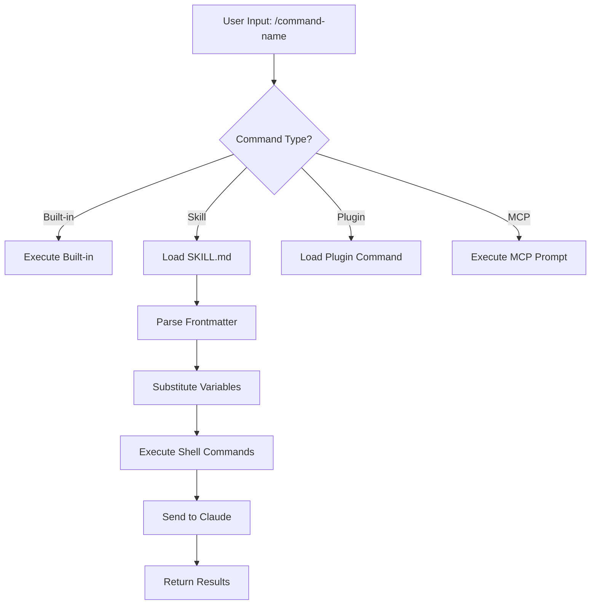
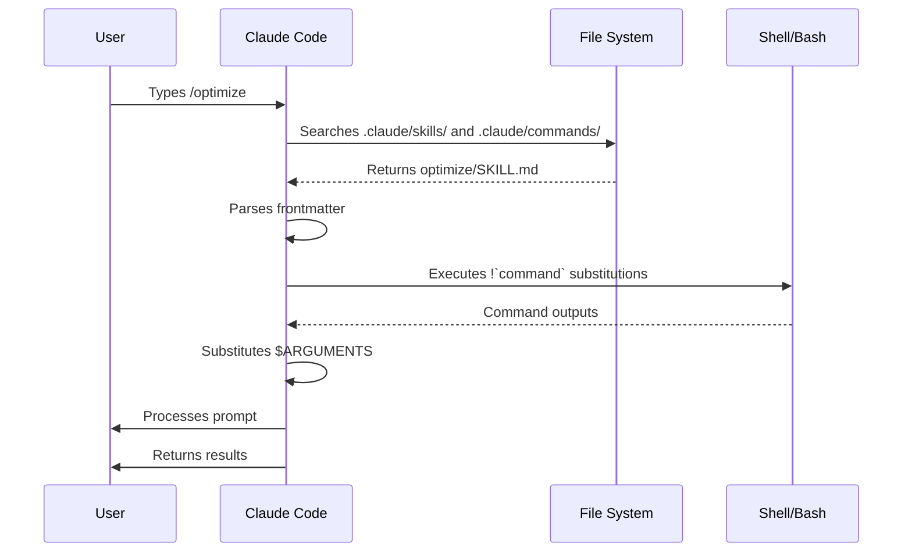

<picture>
  <source media="(prefers-color-scheme: dark)" srcset="../resources/logos/claude-howto-logo-dark.svg">
  
</picture>

# 斜线命令

## 概述

斜杠命令是在交互式会话期间控制 Claude 行为的快捷方式。它们有几种类型：

- **内置命令**：由 Claude Code 提供（`/help`、`/clear`、`/model`）
- **skills**：创建为 `SKILL.md` 文件（`/optimize`、`/pr`）的用户定义命令
- **Plugins命令**：来自已安装Plugins的命令 (`/frontend-design:frontend-design`)
- **MCP 提示**：来自 MCP 服务器的命令 (`/mcp__github__list_prs`)

> **注意**：自定义斜杠命令已合并到skills中。 `.claude/commands/` 中的文件仍然有效，但skills (`.claude/skills/`) 现在是推荐的方法。两者都会创建 `/command-name` 快捷方式。请参阅 [Skills Guide](../03-skills/) 以获取完整参考。

## 内置命令参考

内置命令是常见操作的快捷方式。有 **55 多个内置命令**和 **5 种捆绑skills**可用。在 Claude Code 中键入 `/` 以查看完整列表，或键入 `/` 后跟要过滤的任何字母。

|命令 |目的|
|---------|---------|
| `/add-dir <path>` |添加工作目录 |
| `/agents` |管理agents配置 |
| `/branch [name]` |将对话分支到新会话（别名：`/fork`）。注意：`/fork` 在 v2.1.77 中重命名为 `/branch` |
| `/btw <question>` |不添加历史记录的附带问题|
| `/chrome` |配置 Chrome 浏览器集成 |
| `/clear` |清晰的对话（别名：`/reset`、`/new`）|
| `/color [color\|default]` |设置提示栏颜色 |
| `/compact [instructions]` |带有可选焦点指令的紧凑对话 |
| `/config` |打开设置（别名：`/settings`）|
| `/context` |将上下文使用情况可视化为彩色网格 |
| `/copy [N]` |将助理响应复制到剪贴板； `w` 写入文件 |
| `/cost` |显示tokens使用统计信息 |
| `/desktop` |在桌面应用程序中继续（别名：`/app`）|
| `/diff` |用于未提交更改的交互式差异查看器 |
| `/doctor` |诊断安装运行状况 |
| `/effort [low\|medium\|high\|max\|auto]` |设定努力水平。 `max` 需要 Opus 4.6 |
| `/exit` |退出 REPL（别名：`/quit`）|
| `/export [filename]` |将当前对话导出到文件或剪贴板 |
| `/extra-usage` |配置额外使用率限制 |
| `/fast [on\|off]` |切换快速模式 |
| `/feedback` |提交反馈（别名：`/bug`）|
| `/help` |显示帮助 |
| `/hooks` |查看Hook配置 |
| `/ide` |管理 IDE 集成 |
| `/init` |初始化 `CLAUDE.md`。为交互流程设置 `CLAUDE_CODE_NEW_INIT=true` |
| `/insights` |生成会话分析报告 |
| `/install-github-app` |设置 GitHub Actions 应用程序 |
| `/install-slack-app` |安装 Slack 应用程序 |
| `/keybindings` |打开键绑定配置 |
| `/login` |切换人类帐户 |
| `/logout` |从您的 Anthropic 帐户注销 |
| `/mcp` |管理 MCP 服务器和 OAuth |
| `/memory` |编辑 `CLAUDE.md`，切换自动记忆 |
| `/mobile` |移动应用程序二维码（别名：`/ios`、`/android`）|
| `/model [model]` |选择带有左/右箭头的型号以节省精力 |
| `/passes` |分享claude代码免费周 |
| `/permissions` |查看/更新权限（别名：`/allowed-tools`）|
| `/plan [description]` |进入计划模式|
| `/plugin` |管理Plugins |
| `/pr-comments [PR]` |获取 GitHub PR 评论 |
| `/privacy-settings` |隐私设置（仅限 Pro/Max）|
| `/release-notes` |查看变更日志 |
| `/reload-plugins` |重新加载活动Plugins |
| `/remote-control` |来自 claude.ai 的远程控制（别名：`/rc`）|
| `/remote-env` |配置默认远程环境 |
| `/rename [name]` |重命名会话 |
| `/resume [session]` |恢复对话（别名：`/continue`）|
| `/review` | **已弃用** — 安装 `code-review` Plugins替代 |
| `/rewind` |倒回对话和/或代码（别名：`/checkpoint`）|
| `/sandbox` |切换沙盒模式 |
| `/schedule [description]` |创建/管理计划任务 |
| `/security-review` |分析分支的安全漏洞 |
| `/skills` |列出可用skills |
| `/stats` |可视化日常使用情况、会话、连续使用次数 |
| `/status` |显示版本、型号、帐号 |
| `/statusline` |配置状态行 |
| `/tasks` |列出/管理后台任务 |
| `/terminal-setup` |配置终端键绑定 |
| `/theme` |更改颜色主题 |
| `/vim` |切换 Vim/普通模式 |
| `/voice` |切换一键通语音听写 |

### 捆绑skills

这些skills随 Claude Code 一起提供，并像斜杠命令一样调用：

|skills|目的|
|--------|---------|
| `/batch <instruction>` |使用工作树协调大规模并行变更 |
| `/claude-api` |加载项目语言的 Claude API 参考 |
| `/debug [description]` |启用调试日志记录 |
| `/loop [interval] <prompt>` |按时间间隔重复运行提示 |
| `/simplify [focus]` |检查更改的文件以确保代码质量 |

### 已弃用的命令

|命令 |状态 |
|---------|--------|
| `/review` |已弃用 — 由 `code-review` Plugins取代 |
| `/output-style` |自 v2.1.73 起已弃用 |
| `/fork` |重命名为 `/branch` （别名仍然有效，v2.1.77） |

### 最近的变化

- `/fork` 重命名为 `/branch`，并将 `/fork` 保留为别名 (v2.1.77)
- `/output-style` 已弃用 (v2.1.73)
- `/review` 已弃用，取而代之的是 `code-review` Plugins
- `/effort` 命令添加了需要 Opus 4.6 的 `max` 级别
- 为一键通语音听写添加了 `/voice` 命令
- 添加了 `/schedule` 命令用于创建/管理计划任务
- 添加了 `/color` 命令用于提示栏自定义
- `/model` 选择器现在显示人类可读的标签（例如“Sonnet 4.6”）而不是原始模型 ID
- `/resume` 支持 `/continue` 别名
- MCP 提示可用作 `/mcp__<server>__<prompt>` 命令（请参阅 [MCP Prompts as Commands](#mcp-prompts-as-commands)）

## 自定义命令（现在skills）

自定义斜杠命令已**合并到skills中**。这两种方法都创建可以使用 `/command-name` 调用的命令：

|方法|地点 |状态 |
|----------|----------|--------|
| **skills（推荐）** | `.claude/skills/<name>/SKILL.md` |现行标准 |
| **旧命令** | `.claude/commands/<name>.md` |仍然有效 |

如果skills和命令同名，则**skills优先**。例如，当`.claude/commands/review.md`和`.claude/skills/review/SKILL.md`同时存在时，使用skills版本。

### 迁移路径

您现有的 `.claude/commands/` 文件将继续工作，无需更改。迁移到skills：

**之前（命令）：**
```
.claude/commands/optimize.md
```
**之后（skills）：**
```
.claude/skills/optimize/SKILL.md
```
### 为什么是skills？

与传统命令相比，skills提供了额外的功能：

- **目录结构**：捆绑脚本、模板和参考文件
- **自动调用**：claude可以在相关时自动触发skills
- **调用控制**：选择用户、Claude 或两者是否可以调用
- **Subagents执行**：使用 `context: fork` 在隔离环境中运行skills
- **渐进式披露**：仅在需要时加载其他文件

### 创建自定义命令作为skills

创建一个包含 `SKILL.md` 文件的目录：
```bash
mkdir -p .claude/skills/my-command
```
**文件：** `.claude/skills/my-command/SKILL.md`
```yaml
---
name: my-command
description: What this command does and when to use it
---

# My Command

Instructions for Claude to follow when this command is invoked.

1. First step
2. Second step
3. Third step
```
### Frontmatter 参考

|领域 |目的|默认 |
|--------|---------|---------|
| `name` |命令名称（变为 `/name`）|目录名称 |
| `description` |简要描述（帮助claude知道何时使用它）|第一段 |
| `argument-hint` |自动完成的预期参数 |无 |
| `allowed-tools` |该命令无需许可即可使用的工具 |继承|
| `model` |具体使用型号|继承|
| `disable-model-invocation` |如果 `true`，则只有用户可以调用（claude不能）| `false` |
| `user-invocable` |如果 `false`，则从 `/` 菜单中隐藏 | `true` |
| `context` |设置为 `fork` 以在隔离的Subagents中运行 |无 |
| `agent` |使用 `context: fork` 时的agents类型 | `general-purpose` |
| `hooks` |skills范围的hooks（PreToolUse、PostToolUse、Stop）|无 |

### 参数

命令可以接收参数：

**所有带有 `$ARGUMENTS` 的参数：**
```yaml
---
name: fix-issue
description: Fix a GitHub issue by number
---

Fix issue #$ARGUMENTS following our coding standards
```
用法：`/fix-issue 123` → `$ARGUMENTS` 变为“123”

**带有 `$0`、`$1` 等的单独参数：**
```yaml
---
name: review-pr
description: Review a PR with priority
---

Review PR #$0 with priority $1
```
用法：`/review-pr 456 high` → `$0`="456", `$1`="高"

### 使用 Shell 命令的动态上下文

使用 `!`command`` 在提示符之前执行 bash 命令：
```yaml
---
name: commit
description: Create a git commit with context
allowed-tools: Bash(git *)
---

## Context

- Current git status: !`git status`
- Current git diff: !`git diff HEAD`
- Current branch: !`git branch --show-current`
- Recent commits: !`git log --oneline -5`

## Your task

Based on the above changes, create a single git commit.
```
### 文件参考

使用 `@` 包含文件内容：
```markdown
Review the implementation in @src/utils/helpers.js
Compare @src/old-version.js with @src/new-version.js
```
## Plugins命令

Plugins可以提供自定义命令：
```
/plugin-name:command-name
```
或者在没有命名冲突时简单地使用 `/command-name` 。

**示例：**
```bash
/frontend-design:frontend-design
/commit-commands:commit
```
## MCP 提示作为命令

MCP 服务器可以将提示公开为斜杠命令：
```
/mcp__<server-name>__<prompt-name> [arguments]
```
**示例：**
```bash
/mcp__github__list_prs
/mcp__github__pr_review 456
/mcp__jira__create_issue "Bug title" high
```
### MCP 权限语法

在权限中控制MCP服务器访问：

- `mcp__github` - 访问整个 GitHub MCP 服务器
- `mcp__github__*` - 对所有工具的通配符访问
- `mcp__github__get_issue` - 特定工具访问

## 命令架构

## 命令生命周期

## 此文件夹中的可用命令

这些示例命令可以作为skills或旧命令安装。

### 1. `/optimize` - 代码优化

分析代码的性能问题、内存泄漏和优化机会。

**用法：**
```
/optimize
[Paste your code]
```
### 2. `/pr` - 拉取请求准备

指导 PR 准备清单，包括 linting、测试和提交格式。

**用法：**
```
/pr
```
**截图：**


### 3. `/generate-api-docs` - API 文档生成器

从源代码生成全面的 API 文档。

**用法：**
```
/generate-api-docs
```
### 4. `/commit` - 带上下文的 Git 提交

使用存储库中的动态上下文创建 git 提交。

**用法：**
```
/commit [optional message]
```
### 5. `/push-all` - 阶段、提交和推送

暂存所有更改，创建提交，并通过安全检查推送到远程。

**用法：**
```
/push-all
```
**安全检查：**
- 秘密：`.env*`、`*.key`、`*.pem`、`credentials.json`
- API 密钥：检测真实密钥与占位符
- 大文件：`>10MB`，没有 Git LFS
- 构建工件：`node_modules/`、`dist/`、`__pycache__/`

### 6. `/doc-refactor` - 文档重组

重组项目文档以提高清晰度和可访问性。

**用法：**
```
/doc-refactor
```
### 7. `/setup-ci-cd` - CI/CD 管道设置

实施预提交hooks和 GitHub Actions 以保证质量。

**用法：**
```
/setup-ci-cd
```
### 8. `/unit-test-expand` - 测试覆盖范围扩展

通过针对未经测试的分支和边缘情况来提高测试覆盖率。

**用法：**
```
/unit-test-expand
```
## 安装

### 作为skills（推荐）

复制到您的skills目录：
```bash
# Create skills directory
mkdir -p .claude/skills

# For each command file, create a skill directory
for cmd in optimize pr commit; do
  mkdir -p .claude/skills/$cmd
  cp 01-slash-commands/$cmd.md .claude/skills/$cmd/SKILL.md
done
```
### 作为旧命令

复制到您的命令目录：
```bash
# Project-wide (team)
mkdir -p .claude/commands
cp 01-slash-commands/*.md .claude/commands/

# Personal use
mkdir -p ~/.claude/commands
cp 01-slash-commands/*.md ~/.claude/commands/
```
## 创建您自己的命令

### skills模板（推荐）

创建 `.claude/skills/my-command/SKILL.md`：
```yaml
---
name: my-command
description: What this command does. Use when [trigger conditions].
argument-hint: [optional-args]
allowed-tools: Bash(npm *), Read, Grep
---

# Command Title

## Context

- Current branch: !`git branch --show-current`
- Related files: @package.json

## Instructions

1. First step
2. Second step with argument: $ARGUMENTS
3. Third step

## Output Format

- How to format the response
- What to include
```
### 仅用户命令（无自动调用）

对于claude不应自动触发的具有副作用的命令：
```yaml
---
name: deploy
description: Deploy to production
disable-model-invocation: true
allowed-tools: Bash(npm *), Bash(git *)
---

Deploy the application to production:

1. Run tests
2. Build application
3. Push to deployment target
4. Verify deployment
```
## 最佳实践

|做|不要|
|------|---------|
|使用清晰、面向行动的名称 |为一次性任务创建命令 |
|包含 `description` 和触发条件 |在命令中构建复杂的逻辑 |
|让命令集中于单一任务 |硬编码敏感信息 |
|使用 `disable-model-invocation` 消除副作用 |跳过描述字段 |
|对动态上下文使用 `!` 前缀 |假设claude知道当前状态 |
|整理skills目录中的相关文件 |将所有内容放在一个文件中 |

## 故障排除

### 未找到命令

**解决方案：**
- 检查文件位于 `.claude/skills/<name>/SKILL.md` 或 `.claude/commands/<name>.md` 中
- 验证 frontmatter 中的 `name` 字段与预期的命令名称匹配
- 重新启动claude代码会话
- 运行 `/help` 查看可用命令

### 命令未按预期执行

**解决方案：**
- 添加更具体的说明
- 在skills文件中包含示例
- 如果使用 bash 命令，请检查 `allowed-tools`
- 首先使用简单的输入进行测试

### skills与命令冲突

如果两者同名，则**skills优先**。删除一个或重命名它。

## 相关指南

- **[Skills](../03-skills/)** - skills的完整参考（自动调用的功能）
- **[Memory](../02-memory/)** - CLAUDE.md 的持久上下文
- **[Subagents](../04-subagents/)** - 委托人工智能agents
- **[Plugins](../07-plugins/)** - 捆绑的命令集合
- **[Hooks](../06-hooks/)** - 事件驱动的自动化

## 其他资源

- [Official Interactive Mode Documentation](https://code.claude.com/docs/en/interactive-mode) - 内置命令参考
- [Official Skills Documentation](https://code.claude.com/docs/en/skills) - 完整的skills参考
- [CLI Reference](https://code.claude.com/docs/en/cli-reference) - 命令行选项

---

*[Claude How To](../) 指南系列的一部分*
