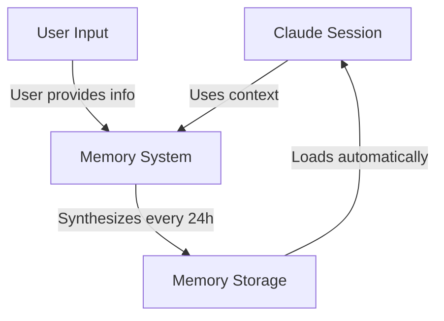
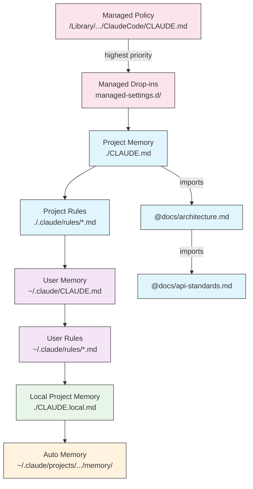
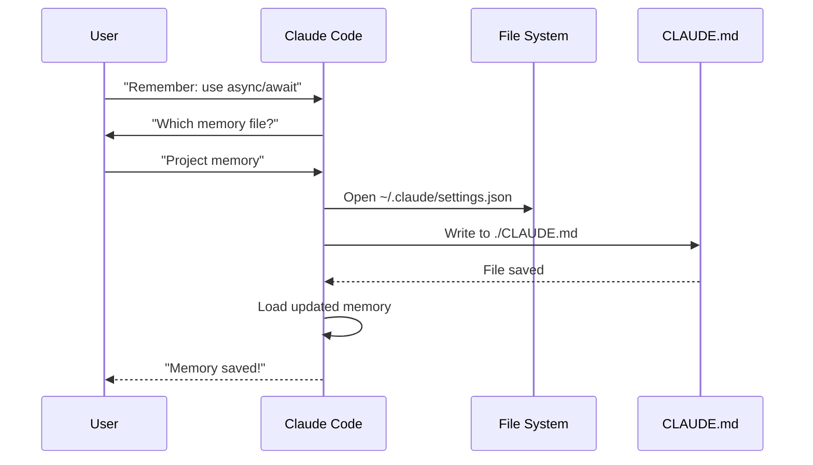
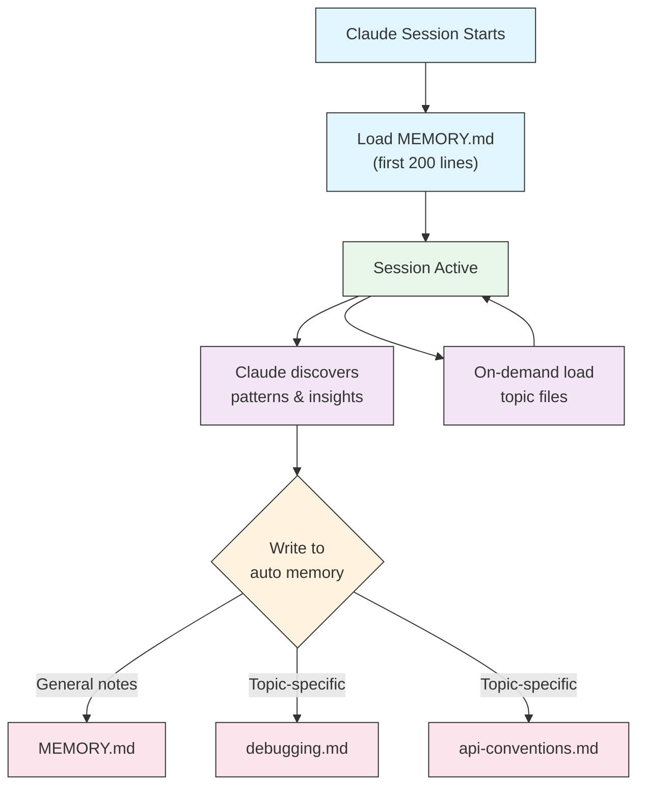

<picture>
<source media="(prefers-color-scheme: dark)" srcset="../resources/logos/claude-howto-logo-dark.svg">

</picture>

# 记忆指南

记忆使claude能够保留会话和对话中的上下文。它以两种形式存在：claude.ai 中的自动合成，以及 Claude Code 中基于文件系统的 CLAUDE.md。

＃＃ 概述

Claude Code 中的内存提供了跨多个会话和对话的持久上下文。与临时上下文窗口不同，内存文件允许您：

- 在您的团队中共享项目标准
- 存储个人发展偏好
- 维护特定于目录的规则和配置
- 导入外部文档
- 版本控制内存作为项目的一部分

记忆系统在多个层面上运行，从全局个人偏好到特定子目录，允许对claude记住的内容以及如何应用这些知识进行精细控制。

## 内存命令快速参考

|命令 |目的|用途 |何时使用 |
|---------|---------|-------|-------------|
| `/init` |初始化项目内存| `/init` |开始新项目，首次 CLAUDE.md 设置 |
| `/memory` |在编辑器中编辑内存文件 | `/memory` |广泛更新、重组、审查内容 |
| `#` 前缀 |快速单行内存添加| `# Your rule here` |在对话期间添加快速规则 |
| `# new rule into memory` |显式内存添加 | `# new rule into memory<br/>Your detailed rule` |添加复杂的多行规则 |
| `# remember this` |自然语言记忆| `# remember this<br/>Your instruction` |对话记忆更新 |
| `@path/to/file` |导入外部内容 | `@README.md` 或 `@docs/api.md` |引用 CLAUDE.md 中的现有文档 |

## 快速入门：初始化内存

### `/init` 命令

`/init` 命令是在 Claude Code 中设置项目内存的最快方法。它使用基础项目文档初始化 CLAUDE.md 文件。

**用法：**

```bash
/init
```

**它的作用：**

- 在您的项目中创建一个新的 CLAUDE.md 文件（通常位于 `./CLAUDE.md` 或 `./.claude/CLAUDE.md`）
- 建立项目公约和指南
- 为跨会话的上下文持久性奠定基础
- 提供用于记录项目标准的模板结构

**增强交互模式：** 设置 `CLAUDE_CODE_NEW_INIT=true` 以启用多阶段交互流程，逐步引导您完成项目设置：

```bash
CLAUDE_CODE_NEW_INIT=true claude
/init
```

**何时使用 `/init`:**

- 使用 Claude Code 开始一个新项目
- 建立团队编码标准和惯例
- 创建有关代码库结构的文档
- 设置内存层次结构以进行协作开发

**工作流程示例：**

```markdown
# In your project directory
/init

# Claude creates CLAUDE.md with structure like:
# Project Configuration
## Project Overview
- Name: Your Project
- Tech Stack: [Your technologies]
- Team Size: [Number of developers]

## Development Standards
- Code style preferences
- Testing requirements
- Git workflow conventions
```

### 使用 `#` 进行快速记忆更新

您可以在任何对话期间通过以 `#` 开头的消息快速将信息添加到记忆中：

**句法：**

```markdown
# Your memory rule or instruction here
```

**示例：**

```markdown
# Always use TypeScript strict mode in this project

# Prefer async/await over promise chains

# Run npm test before every commit

# Use kebab-case for file names
```

**它是如何工作的：**

1. 以 `#` 开始您的消息，后跟您的规则
2.claude将此识别为内存更新请求
3. Claude询问要更新哪个内存文件（项目或个人）
4. 将规则添加到相应的 CLAUDE.md 文件中
5. 未来的会话自动加载此上下文

**替代模式：**

```markdown
# new rule into memory
Always validate user input with Zod schemas

# remember this
Use semantic versioning for all releases

# add to memory
Database migrations must be reversible
```

### `/memory` 命令

`/memory` 命令提供在 Claude Code 会话中编辑 CLAUDE.md 内存文件的直接访问。它在系统编辑器中打开内存文件以进行全面编辑。

**用法：**

```bash
/memory
```

**它的作用：**

- 在系统的默认编辑器中打开内存文件
- 允许您进行广泛的添加、修改和重组
- 提供对层次结构中所有内存文件的直接访问
- 使您能够管理跨会话的持久上下文

**何时使用 `/memory`:**

- 回顾现有的记忆内容
- 对项目标准进行广泛更新
- 重组内存结构
- 添加详细的文档或指南
- 随着项目的发展维护和更新内存

**比较：`/memory` 与 `/init`**

|方面| `/memory` | `/init` |
|--------|-----------|---------|
| **目的** |编辑现有内存文件 |初始化新的 CLAUDE.md |
| **何时使用** |更新/修改项目上下文 |开始新项目|
| **行动** |打开编辑器进行更改 |生成入门模板 |
| **工作流程** |持续维护|一次性设置 |

**工作流程示例：**

```markdown
# Open memory for editing
/memory

# Claude presents options:
# 1. Managed Policy Memory
# 2. Project Memory (./CLAUDE.md)
# 3. User Memory (~/.claude/CLAUDE.md)
# 4. Local Project Memory

# Choose option 2 (Project Memory)
# Your default editor opens with ./CLAUDE.md content

# Make changes, save, and close editor
# Claude automatically reloads the updated memory
```

**使用内存导入：**

CLAUDE.md 文件支持 `@path/to/file` 语法来包含外部内容：

```markdown
# Project Documentation
See @README.md for project overview
See @package.json for available npm commands
See @docs/architecture.md for system design

# Import from home directory using absolute path
@~/.claude/my-project-instructions.md
```

**导入功能：**

- 支持相对路径和绝对路径（例如 `@docs/api.md` 或 `@~/.claude/my-project-instructions.md`）
- 支持递归导入，最大深度为 5
- 首次从外部位置导入会触发安全批准对话框
- 导入指令不会在 Markdown 代码范围或代码块内进行评估（因此在示例中记录它们是安全的）
- 通过引用现有文档帮助避免重复
- 自动包含claude上下文中引用的内容

## 内存架构

claude代码中的内存遵循分层系统，其中不同的范围服务于不同的目的：



## Claude 代码中的内存层次结构

Claude Code 使用多层分层存储系统。 Claude Code 启动时会自动加载内存文件，并优先加载更高级别的文件。

**完整的内存层次结构（按优先顺序）：**

1. **托管策略** - 组织范围的指令
- macOS：`/Library/Application Support/ClaudeCode/CLAUDE.md`
- Linux/WSL：`/etc/claude-code/CLAUDE.md`
- Windows：`C:\Program Files\ClaudeCode\CLAUDE.md`

2. **托管Plugins** - 按字母顺序合并的策略文件 (v2.1.83+)
- `managed-settings.d/` 目录与托管策略 CLAUDE.md
- 文件按字母顺序合并，以进行模块化策略管理

3. **项目内存** - 团队共享上下文（版本控制）
- `./.claude/CLAUDE.md` 或 `./CLAUDE.md` （在存储库根目录中）

4. **项目规则** - 模块化、特定主题的项目说明
- `./.claude/rules/*.md`

5. **用户记忆** - 个人偏好（所有项目）
- `~/.claude/CLAUDE.md`

6. **用户级规则** - 个人规则（所有项目）
- `~/.claude/rules/*.md`

7. **本地项目内存** - 个人项目特定首选项
- `./CLAUDE.local.md`

> **注意**：截至 2026 年 3 月，[official documentation](https://code.claude.com/docs/en/memory) 中未提及 `CLAUDE.local.md`。它可能仍可作为旧功能使用。对于新项目，请考虑使用 `~/.claude/CLAUDE.md` （用户级）或 `.claude/rules/` （项目级，路径范围）。

8. **自动记忆** - claude的自动笔记和学习
- `~/.claude/projects/<project>/memory/`

**内存发现行为：**

claude按以下顺序搜索内存文件，较早的位置优先：



## 排除带有 `claudeMdExcludes` 的 CLAUDE.md 文件

在大型 monorepos 中，某些 CLAUDE.md 文件可能与您当前的工作无关。 `claudeMdExcludes` 设置允许您跳过特定的 CLAUDE.md 文件，这样它们就不会加载到上下文中：

```jsonc
// In ~/.claude/settings.json or .claude/settings.json
{
  "claudeMdExcludes": [
    "packages/legacy-app/CLAUDE.md",
    "vendors/**/CLAUDE.md"
  ]
}
```

模式与相对于项目根的路径进行匹配。这对于以下情况特别有用：

- Monorepos 具有许多子项目，其中只有一些是相关的
- 包含供应商或第三方 CLAUDE.md 文件的存储库
- 通过排除陈旧或不相关的指令来减少claude上下文窗口中的噪音

## 设置文件层次结构

Claude Code 设置（包括 `autoMemoryDirectory`、`claudeMdExcludes` 和其他配置）从五级层次结构中解析，较高级别优先：

|水平|地点 |范围 |
|-------|----------|-------|
| 1（最高）|管理策略（系统级）|全组织范围内的执法 |
| 2 | `managed-settings.d/` (v2.1.83+) |模块化策略Plugins，按字母顺序合并 |
| 3 | `~/.claude/settings.json` |用户偏好 |
| 4 | `.claude/settings.json` |项目级（致力于git）|
| 5（最低）| `.claude/settings.local.json` |本地覆盖（git-ignored） |

**特定于平台的配置（v2.1.51+）：**

还可以通过以下方式配置设置：
- **macOS**：属性列表 (plist) 文件
- **Windows**：Windows 注册表

这些平台本机机制与 JSON 设置文件一起读取，并遵循相同的优先级规则。

## 模块化规则系统

使用 `.claude/rules/` 目录结构创建有组织的、特定于路径的规则。规则可以在项目级别和用户级别定义：

```
your-project/
├── .claude/
│   ├── CLAUDE.md
│   └── rules/
│       ├── code-style.md
│       ├── testing.md
│       ├── security.md
│       └── api/                  # Subdirectories supported
│           ├── conventions.md
│           └── validation.md

~/.claude/
├── CLAUDE.md
└── rules/                        # User-level rules (all projects)
    ├── personal-style.md
    └── preferred-patterns.md
```

规则在 `rules/` 目录（包括任何子目录）中递归发现。 `~/.claude/rules/` 处的用户级规则在项目级规则之前加载，允许项目可以覆盖个人默认值。

### YAML Frontmatter 的路径特定规则

定义仅适用于特定文件路径的规则：

```markdown
---
paths: src/api/**/*.ts
---

# API Development Rules

- All API endpoints must include input validation
- Use Zod for schema validation
- Document all parameters and response types
- Include error handling for all operations
```

**全局模式示例：**

- `**/*.ts` - 所有 TypeScript 文件
- `src/**/*` - src/下的所有文件
- `src/**/*.{ts,tsx}` - 多个扩展
- `{src,lib}/**/*.ts, tests/**/*.test.ts` - 多种模式

### 子目录和符号链接

`.claude/rules/` 中的规则支持两个组织功能：

- **子目录**：规则是递归发现的，因此您可以将它们组织到基于主题的文件夹中（例如，`rules/api/`、`rules/testing/`、`rules/security/`）
- **符号链接**：支持符号链接以跨多个项目共享规则。例如，您可以将共享规则文件从中心位置符号链接到每个项目的 `.claude/rules/` 目录

## 内存位置表

|地点 |范围 |优先|共享|访问 |最适合 |
|----------|-------|----------|--------|--------|----------|
| `/Library/Application Support/ClaudeCode/CLAUDE.md` (macOS) |管理政策| 1（最高）|组织|系统|全公司政策|
| `/etc/claude-code/CLAUDE.md` (Linux/WSL) |管理政策| 1（最高）|组织|系统|组织标准|
| `C:\Program Files\ClaudeCode\CLAUDE.md` (Windows) |管理政策| 1（最高）|组织|系统|企业指引 |
| `managed-settings.d/*.md`（与政策一起）|托管Plugins | 1.5 | 1.5组织|系统|模块化策略文件 (v2.1.83+) |
| `./CLAUDE.md` 或 `./.claude/CLAUDE.md` |项目记忆| 2 |团队| git | git团队标准，共享架构|
| `./.claude/rules/*.md` |项目规则| 3 |团队| git | git路径特定的模块化规则 |
| `~/.claude/CLAUDE.md` |用户记忆| 4 |个人|文件系统 |个人喜好（所有项目）|
| `~/.claude/rules/*.md` |用户规则| 5 |个人|文件系统 |个人规则（所有项目）|
| `./CLAUDE.local.md` |项目本地 | 6 |个人| Git（忽略）|个人项目特定偏好 |
| `~/.claude/projects/<project>/memory/` |自动记忆| 7（最低）|个人|文件系统 |claude的自动笔记和学习|

## 内存更新生命周期

以下是 Claude Code 会话中内存更新的流程：



## 自动记忆

自动记忆是一个持久目录，claude在与您的项目配合使用时自动记录学习内容、模式和见解。与您手动编写和维护的 CLAUDE.md 文件不同，自动内存是由 Claude 在会话期间自行写入的。

### 自动记忆如何工作

- **地点**：`~/.claude/projects/<project>/memory/`
- **入口点**：`MEMORY.md` 作为自动内存目录中的主文件
- **主题文件**：特定主题的可选附加文件（例如 `debugging.md`、`api-conventions.md`）
- **加载行为**：前 200 行 `MEMORY.md` 在会话启动时加载到系统提示符中。主题文件是按需加载的，而不是在启动时加载。
- **读/写**：Claude 在会话期间读取和写入内存文件，因为它发现模式和特定于项目的知识

### 自动内存架构



### 自动内存目录结构

```
~/.claude/projects/<project>/memory/
├── MEMORY.md              # Entrypoint (first 200 lines loaded at startup)
├── debugging.md           # Topic file (loaded on demand)
├── api-conventions.md     # Topic file (loaded on demand)
└── testing-patterns.md    # Topic file (loaded on demand)
```

### 版本要求

自动记忆需要 **Claude Code v2.1.59 或更高版本**。如果您使用的是旧版本，请先升级：

```bash
npm install -g @anthropic-ai/claude-code@latest
```

### 自定义自动存储目录

默认情况下，自动内存存储在 `~/.claude/projects/<project>/memory/` 中。您可以使用 `autoMemoryDirectory` 设置更改此位置（自 **v2.1.74** 起可用）：

```jsonc
// In ~/.claude/settings.json or .claude/settings.local.json (user/local settings only)
{
  "autoMemoryDirectory": "/path/to/custom/memory/directory"
}
```

> **注意**：`autoMemoryDirectory` 只能在用户级别 (`~/.claude/settings.json`) 或本地设置 (`.claude/settings.local.json`) 中设置，而不能在项目或托管策略设置中设置。

当您想要执行以下操作时，这很有用：

- 将自动内存存储在共享或同步位置
- 将自动内存与默认的 Claude 配置目录分开
- 在默认层次结构之外使用特定于项目的路径

### 工作树和存储库共享

同一 git 存储库中的所有工作树和子目录共享一个自动内存目录。这意味着在工作树之间切换或在同一存储库的不同子目录中工作将读取和写入相同的内存文件。

### Subagents内存

Subagents（通过任务或并行执行等工具生成）可以拥有自己的内存上下文。使用Subagents定义中的 `memory` frontmatter 字段来指定要加载的内存范围：

```yaml
memory: user      # Load user-level memory only
memory: project   # Load project-level memory only
memory: local     # Load local memory only
```

这允许Subagents在集中的上下文中进行操作，而不是继承完整的内存层次结构。

### 控制自动记忆

自动内存可以通过 `CLAUDE_CODE_DISABLE_AUTO_MEMORY` 环境变量控制：

|价值|行为 |
|-------|----------|
| `0` |强制自动记忆**打开** |
| `1` |强制自动记忆**关闭** |
| *（未设置）* |默认行为（启用自动记忆）|

```bash
# Disable auto memory for a session
CLAUDE_CODE_DISABLE_AUTO_MEMORY=1 claude

# Force auto memory on explicitly
CLAUDE_CODE_DISABLE_AUTO_MEMORY=0 claude
```

## 带有 `--add-dir` 的其他目录

`--add-dir` 标志允许 Claude Code 从当前工作目录之外的其他目录加载 CLAUDE.md 文件。这对于其他目录的上下文相关的单一存储库或多项目设置非常有用。

要启用此功能，请设置环境变量：

```bash
CLAUDE_CODE_ADDITIONAL_DIRECTORIES_CLAUDE_MD=1
```

然后使用以下标志启动 Claude Code：

```bash
claude --add-dir /path/to/other/project
```

Claude 将从指定的附加目录加载 CLAUDE.md 以及当前工作目录中的内存文件。

## 实际例子

### 示例 1：项目内存结构

**文件：** `./CLAUDE.md`

```markdown
# Project Configuration

## Project Overview
- **Name**: E-commerce Platform
- **Tech Stack**: Node.js, PostgreSQL, React 18, Docker
- **Team Size**: 5 developers
- **Deadline**: Q4 2025

## Architecture
@docs/architecture.md
@docs/api-standards.md
@docs/database-schema.md

## Development Standards

### Code Style
- Use Prettier for formatting
- Use ESLint with airbnb config
- Maximum line length: 100 characters
- Use 2-space indentation

### Naming Conventions
- **Files**: kebab-case (user-controller.js)
- **Classes**: PascalCase (UserService)
- **Functions/Variables**: camelCase (getUserById)
- **Constants**: UPPER_SNAKE_CASE (API_BASE_URL)
- **Database Tables**: snake_case (user_accounts)

### Git Workflow
- Branch names: `feature/description` or `fix/description`
- Commit messages: Follow conventional commits
- PR required before merge
- All CI/CD checks must pass
- Minimum 1 approval required

### Testing Requirements
- Minimum 80% code coverage
- All critical paths must have tests
- Use Jest for unit tests
- Use Cypress for E2E tests
- Test filenames: `*.test.ts` or `*.spec.ts`

### API Standards
- RESTful endpoints only
- JSON request/response
- Use HTTP status codes correctly
- Version API endpoints: `/api/v1/`
- Document all endpoints with examples

### Database
- Use migrations for schema changes
- Never hardcode credentials
- Use connection pooling
- Enable query logging in development
- Regular backups required

### Deployment
- Docker-based deployment
- Kubernetes orchestration
- Blue-green deployment strategy
- Automatic rollback on failure
- Database migrations run before deploy

## Common Commands

| Command | Purpose |
|---------|---------|
| `npm run dev` | Start development server |
| `npm test` | Run test suite |
| `npm run lint` | Check code style |
| `npm run build` | Build for production |
| `npm run migrate` | Run database migrations |

## Team Contacts
- Tech Lead: Sarah Chen (@sarah.chen)
- Product Manager: Mike Johnson (@mike.j)
- DevOps: Alex Kim (@alex.k)

## Known Issues & Workarounds
- PostgreSQL connection pooling limited to 20 during peak hours
- Workaround: Implement query queuing
- Safari 14 compatibility issues with async generators
- Workaround: Use Babel transpiler

## Related Projects
- Analytics Dashboard: `/projects/analytics`
- Mobile App: `/projects/mobile`
- Admin Panel: `/projects/admin`
```

### 示例 2：特定于目录的内存

**文件：** `./src/api/CLAUDE.md`

```markdown
# API Module Standards

This file overrides root CLAUDE.md for everything in /src/api/

## API-Specific Standards

### Request Validation
- Use Zod for schema validation
- Always validate input
- Return 400 with validation errors
- Include field-level error details

### Authentication
- All endpoints require JWT token
- Token in Authorization header
- Token expires after 24 hours
- Implement refresh token mechanism

### Response Format

All responses must follow this structure:

```json
{
“成功”：真实，
"data": { /* 实际数据 */ },
"时间戳": "2025-11-06T10:30:00Z",
“版本”：“1.0”
}
```

Error responses:
```json
{
“成功”：假，
“错误”： {
“代码”：“VALIDATION_ERROR”，
"message": "用户留言",
"details": { /* 字段错误 */ }
  },
“时间戳”：“2025-11-06T10:30:00Z”
}
```

### Pagination
- Use cursor-based pagination (not offset)
- Include `hasMore` boolean
- Limit max page size to 100
- Default page size: 20

### Rate Limiting
- 1000 requests per hour for authenticated users
- 100 requests per hour for public endpoints
- Return 429 when exceeded
- Include retry-after header

### Caching
- Use Redis for session caching
- Cache duration: 5 minutes default
- Invalidate on write operations
- Tag cache keys with resource type
```

### 示例 3：个人记忆

**文件：** `~/.claude/CLAUDE.md`

```markdown
# My Development Preferences

## About Me
- **Experience Level**: 8 years full-stack development
- **Preferred Languages**: TypeScript, Python
- **Communication Style**: Direct, with examples
- **Learning Style**: Visual diagrams with code

## Code Preferences

### Error Handling
I prefer explicit error handling with try-catch blocks and meaningful error messages.
Avoid generic errors. Always log errors for debugging.

### Comments
Use comments for WHY, not WHAT. Code should be self-documenting.
Comments should explain business logic or non-obvious decisions.

### Testing
I prefer TDD (test-driven development).
Write tests first, then implementation.
Focus on behavior, not implementation details.

### Architecture
I prefer modular, loosely-coupled design.
Use dependency injection for testability.
Separate concerns (Controllers, Services, Repositories).

## Debugging Preferences
- Use console.log with prefix: `[DEBUG]`
- Include context: function name, relevant variables
- Use stack traces when available
- Always include timestamps in logs

## Communication
- Explain complex concepts with diagrams
- Show concrete examples before explaining theory
- Include before/after code snippets
- Summarize key points at the end

## Project Organization
I organize my projects as:

   project/
   ├── src/
   │   ├── api/
   │   ├── services/
   │   ├── models/
   │   └── utils/
   ├── tests/
   ├── docs/
   └── docker/

## Tooling
- **IDE**: VS Code with vim keybindings
- **Terminal**: Zsh with Oh-My-Zsh
- **Format**: Prettier (100 char line length)
- **Linter**: ESLint with airbnb config
- **Test Framework**: Jest with React Testing Library
```

_我的测试_
要求claude保存一条新规则


claude尚未保存规则，因为我在任何地方都没有任何 `Claude.md` 文件。然后让claude确认位置。


### 示例 4：会话期间内存更新

您可以在活动的 Claude Code 会话期间将新规则添加到内存中。有两种方法可以做到这一点：

#### 方法一：直接请求

```markdown
User: Remember that I prefer using React hooks instead of class components
     for all new components.

Claude: I'm adding that to your memory. Which memory file should this go in?
        1. Project memory (./CLAUDE.md)
        2. Personal memory (~/.claude/CLAUDE.md)

User: Project memory

Claude: ✅ Memory saved!

Added to ./CLAUDE.md:
---

### Component Development
- Use functional components with React Hooks
- Prefer hooks over class components
- Custom hooks for reusable logic
- Use useCallback for event handlers
- Use useMemo for expensive computations
```

####方法2：使用“#新规则存入内存”模式

您还可以使用显式模式“# newrule into memory”来触发内存更新：

```markdown
User: # new rule into memory
      Always validate user input with Zod schemas before processing.

Claude: I'm saving this rule to memory. Which memory file should I use?
        1. Project memory (./CLAUDE.md)
        2. Personal memory (~/.claude/CLAUDE.md)

User: Project memory

Claude: ✅ Memory saved!

Added to ./CLAUDE.md:
---

### Input Validation
- Always validate user input with Zod schemas before processing
- Define schemas at the top of each API handler file
- Return 400 status with validation errors
```

#### 添加内存的技巧

- 规则具体且可操作
- 将相关规则分组到节标题下
- 更新现有部分而不是重复内容
- 选择适当的内存范围（项目与个人）

## 内存特性比较

|特色|claude网络/桌面|claude代码 (CLAUDE.md) |
|---------|-------------------|------------------------|
|自动合成| ✅ 每 24 小时 | ❌ 手册 |
|跨项目| ✅ 共享 | ❌ 项目特定 |
|团队访问| ✅ 共享项目 | ✅ Git 跟踪 |
|可搜索| ✅ 内置 | ✅ 通过 `/memory` |
|可编辑| ✅ 聊天中 | ✅ 直接文件编辑 |
|进出口| ✅ 是的 | ✅ 复制/粘贴 |
|坚持不懈| ✅ 24 小时以上 | ✅ 无限期 |

### Claude Web/桌面中的内存

#### 内存合成时间线


**内存摘要示例：**

```markdown
## Claude's Memory of User

### Professional Background
- Senior full-stack developer with 8 years experience
- Focus on TypeScript/Node.js backends and React frontends
- Active open source contributor
- Interested in AI and machine learning

### Project Context
- Currently building e-commerce platform
- Tech stack: Node.js, PostgreSQL, React 18, Docker
- Working with team of 5 developers
- Using CI/CD and blue-green deployments

### Communication Preferences
- Prefers direct, concise explanations
- Likes visual diagrams and examples
- Appreciates code snippets
- Explains business logic in comments

### Current Goals
- Improve API performance
- Increase test coverage to 90%
- Implement caching strategy
- Document architecture
```

## 最佳实践

### 要做的事 - 包括什么

- **具体而详细**：使用清晰、详细的说明，而不是模糊的指导
- ✅ 好：“对所有 JavaScript 文件使用 2 个空格缩进”
- ❌避免：“遵循最佳实践”

- **保持井井有条**：使用清晰的降价部分和标题来构建内存文件

- **使用适当的层次结构级别**：
- **托管政策**：公司范围内的政策、安全标准、合规性要求
- **项目记忆**：团队标准、架构、编码约定（提交到 git）
- **用户记忆**：个人喜好、沟通方式、工具选择
- **目录内存**：模块特定的规则和覆盖

- **利用导入**：使用 `@path/to/file` 语法引用现有文档
- 支持最多5层递归嵌套
- 避免内存文件之间的重复
- 示例：`See @README.md for project overview`

- **记录常用命令**：包括您重复使用的命令以节省时间

- **版本控制项目内存**：将项目级 CLAUDE.md 文件提交到 git 以实现团队利益

- **定期审查**：随着项目的发展和需求的变化定期更新内存

- **提供具体示例**：包括代码片段和具体场景

### 不该做的事 - 要避免什么

- **不存储机密**：切勿包含 API 密钥、密码、Token或凭据

- **不包含敏感数据**：无 PII、私人信息或专有秘密

- **不要重复内容**：使用导入 (`@path`) 来引用现有文档

- **不要含糊**：避免使用“遵循最佳实践”或“编写良好代码”等通用语句

- **不要让它太长**：保持单个内存文件集中且少于 500 行

- **不要过度组织**：战略性地使用层次结构；不要创建过多的子目录覆盖

- **不要忘记更新**：陈旧的内存可能会导致混乱和过时的做法

- **不要超过嵌套限制**：内存导入支持最多 5 层嵌套

### 内存管理技巧

**选择正确的内存级别：**

|使用案例|内存级别 |理由|
|----------|-------------|-----------|
|公司安全政策|管理政策|适用于组织范围内的所有项目 |
|团队代码风格指南 |项目|通过 git 与团队共享 |
|您首选的编辑器快捷方式 |用户 |个人喜好，不共享|
| API模块标准|目录 |仅特定于该模块 |

**快速更新工作流程：**

1. 对于单个规则：在会话中使用 `#` 前缀
2. 对于多个更改：使用 `/memory` 打开编辑器
3. 初始设置：使用 `/init` 创建模板

**导入最佳实践：**

```markdown
# Good: Reference existing docs
@README.md
@docs/architecture.md
@package.json

# Avoid: Copying content that exists elsewhere
# Instead of copying README content into CLAUDE.md, just import it
```

## 安装说明

### 设置项目内存

#### 方法一：使用`/init`命令（推荐）

设置项目内存的最快方法：

1. **导航到您的项目目录：**
   ```bash
   cd /path/to/your/project
   ```

2. **在Claude代码中运行init命令：**
   ```bash
   /init
   ```

3. **Claude 将使用模板结构创建并填充 CLAUDE.md**

4. **自定义生成的文件**以满足您的项目需求

5. **提交到 git:**
   ```bash
   git add CLAUDE.md
   git commit -m "Initialize project memory with /init"
   ```

#### 方法二：手动创建

如果您更喜欢手动设置：

1. **在项目根目录中创建CLAUDE.md：**
   ```bash
   cd /path/to/your/project
   touch CLAUDE.md
   ```

2. **添加项目标准：**
   ```bash
   cat > CLAUDE.md << 'EOF'
   # Project Configuration

   ## Project Overview
   - **Name**: Your Project Name
   - **Tech Stack**: List your technologies
   - **Team Size**: Number of developers

   ## Development Standards
   - Your coding standards
   - Naming conventions
   - Testing requirements
   EOF
   ```

3. **提交到git：**
   ```bash
   git add CLAUDE.md
   git commit -m "Add project memory configuration"
   ```

#### 方法 3：使用 `#` 快速更新

一旦 CLAUDE.md 存在，就可以在对话期间快速添加规则：

```markdown
# Use semantic versioning for all releases

# Always run tests before committing

# Prefer composition over inheritance
```

claude会提示你选择要更新的内存文件。

### 设置个人内存

1. **创建~/.claude目录：**
   ```bash
   mkdir -p ~/.claude
   ```

2. **创建个人CLAUDE.md:**
   ```bash
   touch ~/.claude/CLAUDE.md
   ```

3. **添加您的偏好：**
   ```bash
   cat > ~/.claude/CLAUDE.md << 'EOF'
   # My Development Preferences

   ## About Me
   - Experience Level: [Your level]
   - Preferred Languages: [Your languages]
   - Communication Style: [Your style]

   ## Code Preferences
   - [Your preferences]
   EOF
   ```

### 设置目录特定内存

1. **为特定目录创建内存：**
   ```bash
   mkdir -p /path/to/directory/.claude
   touch /path/to/directory/CLAUDE.md
   ```

2. **添加特定于目录的规则：**
   ```bash
   cat > /path/to/directory/CLAUDE.md << 'EOF'
   # [Directory Name] Standards

   This file overrides root CLAUDE.md for this directory.

   ## [Specific Standards]
   EOF
   ```

3. **致力于版本控制：**
   ```bash
   git add /path/to/directory/CLAUDE.md
   git commit -m "Add [directory] memory configuration"
   ```

### 验证设置

1. **检查内存位置：**
   ```bash
   # Project root memory
   ls -la ./CLAUDE.md

   # Personal memory
   ls -la ~/.claude/CLAUDE.md
   ```

2. **Claude Code 在启动会话时会自动加载**这些文件

3. **通过在项目中启动新会话来使用 Claude Code 进行测试**

## 官方文档

有关最新信息，请参阅 Claude Code 官方文档：

- **[Memory Documentation](https://code.claude.com/docs/en/memory)** - 完整的内存系统参考
- **[Slash Commands Reference](https://code.claude.com/docs/en/interactive-mode)** - 所有内置命令，包括 `/init` 和 `/memory`
- **[CLI Reference](https://code.claude.com/docs/en/cli-reference)** - 命令行界面文档

### 官方文档中的关键技术细节

**内存加载：**

- 当 Claude Code 启动时，所有内存文件都会自动加载
- Claude从当前工作目录向上遍历发现CLAUDE.md文件
- 访问这些目录时，会发现并加载子树文件

**导入语法：**

- 使用 `@path/to/file` 包含外部内容（例如 `@~/.claude/my-project-instructions.md`）
- 支持相对和绝对路径
- 支持递归导入，最大深度为 5
- 首次外部导入会触发批准对话框
- 不在 Markdown 代码范围或代码块内进行评估
- 自动包含claude上下文中引用的内容

**内存层次结构优先级：**

1. 托管策略（最高优先级）
2. 托管Plugins（`managed-settings.d/`，v2.1.83+）
3. 项目记忆
4. 项目规则 (`.claude/rules/`)
5. 用户记忆
6. 用户级规则 (`~/.claude/rules/`)
7. 本地项目内存
8. 自动记忆（最低优先级）

## 相关概念链接

### 整合点
- [MCP Protocol](../05-mcp/) - 与内存一起实时数据访问
- [Slash Commands](../01-slash-commands/) - 特定于会话的快捷键
- [Skills](../03-skills/) - 具有内存上下文的自动化工作流程

### 相关claude特征
- [Claude Web Memory](https://claude.ai) - 自动合成
- [Official Memory Docs](https://code.claude.com/docs/en/memory) - 人为文档
