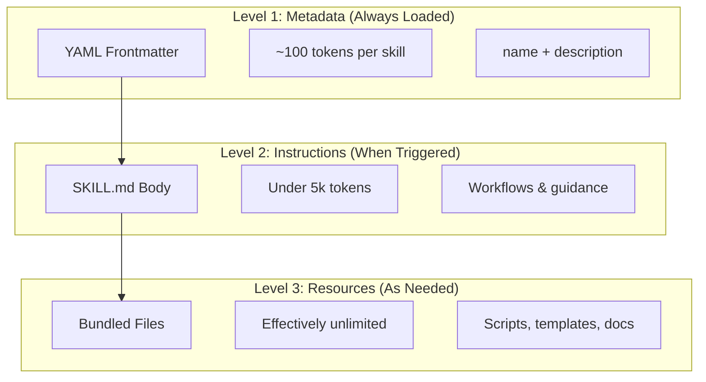
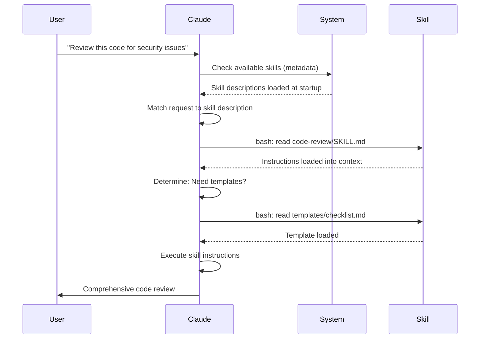

<picture>
<source media="(prefers-color-scheme: dark)" srcset="../resources/logos/claude-howto-logo-dark.svg">

</picture>

# Agent Skills指南

Agent Skills是可重用的、基于文件系统的功能，可扩展 Claude 的功能。他们将特定领域的专业知识、工作流程和最佳实践打包到可发现的组件中，claude在相关时自动使用这些组件。

## 概述

**Agent Skills**是模块化功能，可将通用agents转变为专家。与提示（一次性任务的对话级说明）不同，skills按需加载，无需在多个对话中重复提供相同的指导。

### 主要优点

- **专业化 Claude**：针对特定领域的任务定制功能
- **减少重复**：创建一次，在对话中自动使用
- **撰写功能**：结合skills来构建复杂的工作流程
- **扩展工作流程**：在多个项目和团队中重用skills
- **保持质量**：将最佳实践直接嵌入到您的工作流程中

skills遵循 [Agent Skills](https://agentskills.io) 开放标准，该标准适用于多种 AI 工具。 Claude Code 通过调用控制、Subagents执行和动态上下文注入等附加功能扩展了标准。

> **注意**：自定义斜杠命令已合并到skills中。 `.claude/commands/` 文件仍然有效并支持相同的 frontmatter 字段。推荐skills用于新的发展。当两者存在于同一路径时（例如 `.claude/commands/review.md` 和 `.claude/skills/review/SKILL.md`），该skills优先。

## skills如何发挥作用：渐进式披露

skills利用**渐进式披露**架构——claude根据需要分阶段加载信息，而不是预先消耗上下文。这可以实现高效的上下文管理，同时保持无限的可扩展性。

### 三个加载级别

|水平|加载时 |tokens成本 |内容 |
|--------|------------|------------|---------|
| **级别 1：元数据** |始终（启动时）|每个skills约 100 个tokens | YAML frontmatter 中的 `name` 和 `description` |
| **第 2 级：说明** |skills触发时 |低于 5k tokens | SKILL.md 正文，附有说明和指导 |
| **3 级以上：资源** |根据需要|有效无限制 |通过 bash 执行捆绑文件，无需将内容加载到上下文中 |

这意味着您可以安装许多skills而不会受到上下文影响 - claude只知道每个skills的存在以及何时使用它，直到实际触发为止。

## skills加载过程

## skills类型和地点

|类型 |地点 |范围 |共享|最适合 |
|------|----------|--------|--------|----------|
| **企业** |托管设置 |所有组织用户 |是的 |组织范围的标准 |
| **个人** | `~/.claude/skills/<skill-name>/SKILL.md` |个人|没有 |个人工作流程|
| **项目** | `.claude/skills/<skill-name>/SKILL.md` |团队|是（通过 git）|团队标准|
| **Plugins** | `<plugin>/skills/<skill-name>/SKILL.md` |哪里启用 |取决于 |捆绑Plugins |

当skills在各个级别共享相同名称时，优先级较高的位置会获胜：**企业 > 个人 > 项目**。Pluginsskills使用 `plugin-name:skill-name` 命名空间，因此它们不会发生冲突。

### 自动发现

**嵌套目录**：当您处理子目录中的文件时，Claude Code 会自动从嵌套 `.claude/skills/` 目录中发现skills。例如，如果您正在编辑 `packages/frontend/` 中的文件，Claude Code 还会查找 `packages/frontend/.claude/skills/` 中的skills。这支持 monorepo 设置，其中包有自己的skills。

**`--add-dir` 目录**：通过 `--add-dir` 添加的目录中的skills会通过实时更改检测自动加载。对这些目录中skills文件的任何编辑都会立即生效，无需重新启动 Claude Code。

**描述预算**：skills描述（1 级元数据）的上限为 **上下文窗口的 2%**（后备：**16,000 个字符**）。如果您安装了许多skills，则某些skills可能会被排除。运行 `/context` 以检查警告。使用 `SLASH_COMMAND_TOOL_CHAR_BUDGET` 环境变量覆盖预算。

## 创建自定义skills

### 基本目录结构
```
my-skill/
├── SKILL.md           # Main instructions (required)
├── template.md        # Template for Claude to fill in
├── examples/
│   └── sample.md      # Example output showing expected format
└── scripts/
    └── validate.sh    # Script Claude can execute
```
### SKILL.md 格式
```yaml
---
name: your-skill-name
description: Brief description of what this Skill does and when to use it
---

# Your Skill Name

## Instructions
Provide clear, step-by-step guidance for Claude.

## Examples
Show concrete examples of using this Skill.
```
### 必填字段

- **名称**：仅限小写字母、数字、连字符（最多 64 个字符）。不能包含“anthropic”或“claude”。
- **描述**：skills的作用以及何时使用它（最多 1024 个字符）。这对于claude知道何时启动skills至关重要。

### 可选的 Frontmatter 字段
```yaml
---
name: my-skill
description: What this skill does and when to use it
argument-hint: "[filename] [format]"        # Hint for autocomplete
disable-model-invocation: true              # Only user can invoke
user-invocable: false                       # Hide from slash menu
allowed-tools: Read, Grep, Glob             # Restrict tool access
model: opus                                 # Specific model to use
effort: high                                # Effort level override (low, medium, high, max)
context: fork                               # Run in isolated subagent
agent: Explore                              # Which agent type (with context: fork)
shell: bash                                 # Shell for commands: bash (default) or powershell
hooks:                                      # Skill-scoped hooks
  PreToolUse:
    - matcher: "Bash"
      hooks:
        - type: command
          command: "./scripts/validate.sh"
---
```
|领域 |描述 |
|--------|-------------|
| `name` |仅小写字母、数字、连字符（最多 64 个字符）。不能包含“anthropic”或“claude”。 |
| `description` |该skills的作用以及何时使用它（最多 1024 个字符）。对于自动调用匹配至关重要。 |
| `argument-hint` | `/` 自动完成菜单中显示的提示（例如 `"[filename] [format]"`）。 |
| `disable-model-invocation` | `true` = 只有用户可以通过 `/name` 调用。claude永远不会自动调用。 |
| `user-invocable` | `false` = 从 `/` 菜单中隐藏。只有claude可以自动调用它。 |
| `allowed-tools` |skills可以在没有权限提示的情况下使用的以逗号分隔的工具列表。 |
| `model` |skills处于活动状态时模型覆盖（例如 `opus`、`sonnet`）。 |
| `effort` |skills激活时的努力程度覆盖：`low`、`medium`、`high` 或 `max`。 |
| `context` | `fork` 在具有自己的上下文窗口的分叉Subagents上下文中运行skills。 |
| `agent` | `context: fork` 时的Subagents类型（例如 `Explore`、`Plan`、`general-purpose`）。 |
| `shell` |用于`!`命令``替换和脚本的外壳：`bash`（默认）或`powershell`。 |
| `hooks` |hooks范围仅限于该skills的生命周期（与全局hooks格式相同）。 |

## skills内容类型

skills可以包含两种类型的内容，每种内容适合不同的目的：

### 参考内容

添加 Claude 适用于您当前工作的知识 — 惯例、模式、风格指南、领域知识。与您的对话上下文一致运行。
```yaml
---
name: api-conventions
description: API design patterns for this codebase
---

When writing API endpoints:
- Use RESTful naming conventions
- Return consistent error formats
- Include request validation
```
### 任务内容

具体操作的分步说明。通常直接使用 `/skill-name` 调用。
```yaml
---
name: deploy
description: Deploy the application to production
context: fork
disable-model-invocation: true
---

Deploy the application:
1. Run the test suite
2. Build the application
3. Push to the deployment target
```
## 控制skills调用

默认情况下，你和claude都可以调用任何skills。两个 frontmatter 字段控制三种调用模式：

|前沿 |您可以调用 |claude可以调用|
|---|---|---|
| （默认）|是的 |是的 |
| `disable-model-invocation: true` |是的 |没有 |
| `user-invocable: false` |没有 |是的 |

**对有副作用的工作流程使用 `disable-model-invocation: true`**：`/commit`、`/deploy`、`/send-slack-message`。您不希望 Claude 因为您的代码看起来已准备就绪而决定进行部署。

**使用 `user-invocable: false`** 获取无法作为命令操作的背景知识。 `legacy-system-context` skills解释了旧系统的工作原理——对 Claude 有用，但对用户来说没有意义。

## 字符串替换

skills支持在skills内容到达claude之前解析的动态值：

|变量|描述 |
|----------|-------------|
| `$ARGUMENTS` |调用skills时所有参数均已传递 |
| `$ARGUMENTS[N]` 或 `$N` |通过索引（从 0 开始）访问特定参数 |
| `${CLAUDE_SESSION_ID}` |当前会话 ID |
| `${CLAUDE_SKILL_DIR}` |包含skills的 SKILL.md 文件的目录 |
| `` !`command` `` |动态上下文注入 — 运行 shell 命令并内联输出 |

**例子：**
```yaml
---
name: fix-issue
description: Fix a GitHub issue
---

Fix GitHub issue $ARGUMENTS following our coding standards.
1. Read the issue description
2. Implement the fix
3. Write tests
4. Create a commit
```
运行 `/fix-issue 123` 会将 `$ARGUMENTS` 替换为 `123`。

## 注入动态上下文

`!`command`` 语法在将skills内容发送给 Claude 之前运行 shell 命令：
```yaml
---
name: pr-summary
description: Summarize changes in a pull request
context: fork
agent: Explore
---

## Pull request context
- PR diff: !`gh pr diff`
- PR comments: !`gh pr view --comments`
- Changed files: !`gh pr diff --name-only`

## Your task
Summarize this pull request...
```
命令立即执行；claude只看到最终的输出。默认情况下，命令在 `bash` 中运行。在 frontmatter 中设置 `shell: powershell` 以改用 PowerShell。

## Subagents中的运行技巧

添加 `context: fork` 以在隔离的Subagents上下文中运行skills。skills内容成为具有自己的上下文窗口的专用Subagents的任务，使主要对话保持整洁。

`agent` 字段指定要使用的agents类型：

|agents类型 |最适合 |
|---|---|
| `Explore` |只读研究、代码库分析 |
| `Plan` |制定实施计划|
| `general-purpose` |需要所有工具的广泛任务 |
|定制agents|您的配置中定义的专业agents |

**前言示例：**
```yaml
---
context: fork
agent: Explore
---
```
**完整skills示例：**
```yaml
---
name: deep-research
description: Research a topic thoroughly
context: fork
agent: Explore
---

Research $ARGUMENTS thoroughly:
1. Find relevant files using Glob and Grep
2. Read and analyze the code
3. Summarize findings with specific file references
```
## 实际例子

### 示例 1：代码审查技巧

**目录结构：**
```
~/.claude/skills/code-review/
├── SKILL.md
├── templates/
│   ├── review-checklist.md
│   └── finding-template.md
└── scripts/
    ├── analyze-metrics.py
    └── compare-complexity.py
```
**文件：** `~/.claude/skills/code-review/SKILL.md`
```yaml
---
name: code-review-specialist
description: Comprehensive code review with security, performance, and quality analysis. Use when users ask to review code, analyze code quality, evaluate pull requests, or mention code review, security analysis, or performance optimization.
---

# Code Review Skill

This skill provides comprehensive code review capabilities focusing on:

1. **Security Analysis**
   - Authentication/authorization issues
   - Data exposure risks
   - Injection vulnerabilities
   - Cryptographic weaknesses

2. **Performance Review**
   - Algorithm efficiency (Big O analysis)
   - Memory optimization
   - Database query optimization
   - Caching opportunities

3. **Code Quality**
   - SOLID principles
   - Design patterns
   - Naming conventions
   - Test coverage

4. **Maintainability**
   - Code readability
   - Function size (should be < 50 lines)
   - Cyclomatic complexity
   - Type safety

## Review Template

For each piece of code reviewed, provide:

### Summary
- Overall quality assessment (1-5)
- Key findings count
- Recommended priority areas

### Critical Issues (if any)
- **Issue**: Clear description
- **Location**: File and line number
- **Impact**: Why this matters
- **Severity**: Critical/High/Medium
- **Fix**: Code example

For detailed checklists, see [templates/review-checklist.md](templates/review-checklist.md).
```
### 示例 2：代码库可视化skills

生成交互式 HTML 可视化的skills：

**目录结构：**
```
~/.claude/skills/codebase-visualizer/
├── SKILL.md
└── scripts/
    └── visualize.py
```
**文件：** `~/.claude/skills/codebase-visualizer/SKILL.md`
```yaml
---
name: codebase-visualizer
description: Generate an interactive collapsible tree visualization of your codebase. Use when exploring a new repo, understanding project structure, or identifying large files.
allowed-tools: Bash(python *)
---

# Codebase Visualizer

Generate an interactive HTML tree view showing your project's file structure.

## Usage

Run the visualization script from your project root:

```bash
python ~/.claude/skills/codebase-visualizer/scripts/visualize.py 。
```

This creates `codebase-map.html` and opens it in your default browser.

## What the visualization shows

- **Collapsible directories**: Click folders to expand/collapse
- **File sizes**: Displayed next to each file
- **Colors**: Different colors for different file types
- **Directory totals**: Shows aggregate size of each folder
```
捆绑的 Python 脚本负责繁重的工作，而 Claude 负责编排。

### 示例 3：部署skills（仅限用户调用）
```yaml
---
name: deploy
description: Deploy the application to production
disable-model-invocation: true
allowed-tools: Bash(npm *), Bash(git *)
---

Deploy $ARGUMENTS to production:

1. Run the test suite: `npm test`
2. Build the application: `npm run build`
3. Push to the deployment target
4. Verify the deployment succeeded
5. Report deployment status
```
### 示例4：品牌声音技巧（背景知识）
```yaml
---
name: brand-voice
description: Ensure all communication matches brand voice and tone guidelines. Use when creating marketing copy, customer communications, or public-facing content.
user-invocable: false
---

## Tone of Voice
- **Friendly but professional** - approachable without being casual
- **Clear and concise** - avoid jargon
- **Confident** - we know what we're doing
- **Empathetic** - understand user needs

## Writing Guidelines
- Use "you" when addressing readers
- Use active voice
- Keep sentences under 20 words
- Start with value proposition

For templates, see [templates/](templates/).
```
### 示例 5：CLAUDE.md 生成器skills
```yaml
---
name: claude-md
description: Create or update CLAUDE.md files following best practices for optimal AI agent onboarding. Use when users mention CLAUDE.md, project documentation, or AI onboarding.
---

## Core Principles

**LLMs are stateless**: CLAUDE.md is the only file automatically included in every conversation.

### The Golden Rules

1. **Less is More**: Keep under 300 lines (ideally under 100)
2. **Universal Applicability**: Only include information relevant to EVERY session
3. **Don't Use Claude as a Linter**: Use deterministic tools instead
4. **Never Auto-Generate**: Craft it manually with careful consideration

## Essential Sections

- **Project Name**: Brief one-line description
- **Tech Stack**: Primary language, frameworks, database
- **Development Commands**: Install, test, build commands
- **Critical Conventions**: Only non-obvious, high-impact conventions
- **Known Issues / Gotchas**: Things that trip up developers
```
### 示例 6：脚本重构技巧

**目录结构：**
```
refactor/
├── SKILL.md
├── references/
│   ├── code-smells.md
│   └── refactoring-catalog.md
├── templates/
│   └── refactoring-plan.md
└── scripts/
    ├── analyze-complexity.py
    └── detect-smells.py
```
**文件：** `refactor/SKILL.md`
```yaml
---
name: code-refactor
description: Systematic code refactoring based on Martin Fowler's methodology. Use when users ask to refactor code, improve code structure, reduce technical debt, or eliminate code smells.
---

# Code Refactoring Skill

A phased approach emphasizing safe, incremental changes backed by tests.

## Workflow

Phase 1: Research & Analysis → Phase 2: Test Coverage Assessment →
Phase 3: Code Smell Identification → Phase 4: Refactoring Plan Creation →
Phase 5: Incremental Implementation → Phase 6: Review & Iteration

## Core Principles

1. **Behavior Preservation**: External behavior must remain unchanged
2. **Small Steps**: Make tiny, testable changes
3. **Test-Driven**: Tests are the safety net
4. **Continuous**: Refactoring is ongoing, not a one-time event

For code smell catalog, see [references/code-smells.md](references/code-smells.md).
For refactoring techniques, see [references/refactoring-catalog.md](references/refactoring-catalog.md).
```
## 支持文件

skills可以在其目录中包含 `SKILL.md` 之外的多个文件。这些支持文件（模板、示例、脚本、参考文档）可让您保持主要skills文件的重点，同时为 Claude 提供可根据需要加载的其他资源。
```
my-skill/
├── SKILL.md              # Main instructions (required, keep under 500 lines)
├── templates/            # Templates for Claude to fill in
│   └── output-format.md
├── examples/             # Example outputs showing expected format
│   └── sample-output.md
├── references/           # Domain knowledge and specifications
│   └── api-spec.md
└── scripts/              # Scripts Claude can execute
    └── validate.sh
```
支持文件指南：

- 将 `SKILL.md` 保持在 **500 行**以下。将详细的参考材料、大型示例和规范移至单独的文件中。
- 使用 **相对路径** 从 `SKILL.md` 引用其他文件（例如 `[API reference](references/api-spec.md)`）。
- 支持文件在第 3 级加载（根据需要），因此在 Claude 实际读取它们之前它们不会消耗上下文。

## 管理技巧

### 查看可用skills

直接问claude：
```
What Skills are available?
```
或者检查文件系统：
```bash
# List personal Skills
ls ~/.claude/skills/

# List project Skills
ls .claude/skills/
```
### 测试skills

两种测试方法：

**让claude通过询问与描述相匹配的内容来自动调用它**：
```
Can you help me review this code for security issues?
```
**或者直接使用skills名称调用**：
```
/code-review src/auth/login.ts
```
### 更新skills

直接编辑 `SKILL.md` 文件。更改将在下一次 Claude Code 启动时生效。
```bash
# Personal Skill
code ~/.claude/skills/my-skill/SKILL.md

# Project Skill
code .claude/skills/my-skill/SKILL.md
```
### 限制claude的skills使用

控制claude可以调用哪些skills的三种方法：

**禁用 `/permissions` 中的所有skills**：
```
# Add to deny rules:
Skill
```
**允许或拒绝特定skills**：
```
# Allow only specific skills
Skill(commit)
Skill(review-pr *)

# Deny specific skills
Skill(deploy *)
```
**通过在其前言中添加 `disable-model-invocation: true` 来隐藏个人skills**。

## 最佳实践

### 1. 使描述具体化

- **不好（含糊）**：“帮助处理文档”
- **好（特定）**：“从 PDF 文件中提取文本和表格、填写表单、合并文档。在处理 PDF 文件或用户提到 PDF、表单或文档提取时使用。”

### 2. 专注于skills

- 一项skills = 一项能力
- ✅“PDF表格填写”
- ❌“文档处理”（太宽泛）

### 3. 包含触发条件

在描述中添加符合用户请求的关键字：
```yaml
description: Analyze Excel spreadsheets, generate pivot tables, create charts. Use when working with Excel files, spreadsheets, or .xlsx files.
```
### 4. 将 SKILL.md 保持在 500 行以下

将详细的参考资料移至 Claude 根据需要加载的单独文件中。

### 5. 参考支持文件
```markdown
## Additional resources

- For complete API details, see [reference.md](reference.md)
- For usage examples, see [examples.md](examples.md)
```
### 要做的事

- 使用清晰、描述性的名称
- 包括全面的说明
- 添加具体示例
- 打包相关脚本和模板
- 使用真实场景进行测试
- 文档依赖关系

### 不该做的事

- 不要为一次性任务创造skills
- 不要重复现有的功能
- 不要让skills太广泛
- 不要跳过描述字段
- 未经审核，请勿安装来自不受信任来源的skills

## 故障排除

### 快速参考

|问题 |解决方案 |
|--------|----------|
|claude不使用skills|使用触发术语使描述更加具体 |
|找不到skills文件 |验证路径：`~/.claude/skills/name/SKILL.md` |
| YAML 错误 |检查 `---` 标记、缩进、无制表符 |
|skills冲突|在描述中使用不同的触发术语 |
|脚本未运行 |检查权限：`chmod +x scripts/*.py` |
|claude看不到所有skills |skills太多；检查 `/context` 是否有警告 |

### skills未触发

如果claude没有按预期使用你的skills：

1. 检查描述是否包含用户自然会说的关键词
2. 确认当询问“有哪些skills可用？”时会出现该skills。
3. 尝试重新表述您的请求以匹配描述
4.直接用`/skill-name`调用进行测试

### skills触发过于频繁

如果claude在你不想要的时候使用了你的skills：

1.使描述更加具体
2. 添加 `disable-model-invocation: true` 用于仅手动调用

### claude看不到所有skills

skills描述在上下文窗口的 **2%** 处加载（回退：**16,000 个字符**）。运行 `/context` 以检查有关排除skills的警告。使用 `SLASH_COMMAND_TOOL_CHAR_BUDGET` 环境变量覆盖预算。

## 安全考虑

**仅使用来自可信来源的skills。** skills通过指令和代码为 Claude 提供功能 - 恶意skills可以引导 Claude 以有害方式调用工具或执行代码。

**关键安全考虑因素：**

- **彻底审核**：审核skills目录中的所有文件
- **外部来源有风险**：从外部 URL 获取的skills可能会受到损害
- **工具滥用**：恶意skills可以以有害的方式调用工具
- **像安装软件一样对待**：仅使用来自可信来源的skills

## skills与其他功能

|特色|调用|最适合 |
|---------|------------|----------|
| **skills** |自动或 `/name` |可重复使用的专业知识、工作流程 |
| **斜线命令** |用户发起的 `/name` |快速快捷键（合并到skills中）|
| **Subagents** |自动委派|隔离任务执行 |
| **内存（CLAUDE.md）** |始终加载|持久的项目背景 |
| **MCP** |实时|外部数据/服务访问 |
| **hooks** |事件驱动|自动副作用 |

## 捆绑skills

Claude Code 附带了几种内置skills，无需安装即可随时使用：

|skills|描述 |
|--------|-------------|
| `/simplify` |审查更改的文件的重用性、质量和效率；产生 3 个并行审查agents |
| `/batch <instruction>` |使用 git 工作树协调跨代码库的大规模并行更改 |
| `/debug [description]` |通过读取调试日志对当前会话进行故障排除 |
| `/loop [interval] <prompt>` |按时间间隔重复运行提示（例如 `/loop 5m check the deploy`）|
| `/claude-api` |加载 Claude API/SDK 参考；在 `anthropic`/`@anthropic-ai/sdk` 导入时自动激活 |

这些skills是开箱即用的，不需要安装或配置。它们遵循与自定义skills相同的 SKILL.md 格式。

## 分享技巧

### 项目skills（团队分享）

1. 在 `.claude/skills/` 中创造skills
2. 致力于git
3. 团队成员拉动变革——skills立即可用

### 个人skills
```bash
# Copy to personal directory
cp -r my-skill ~/.claude/skills/

# Make scripts executable
chmod +x ~/.claude/skills/my-skill/scripts/*.py
```
### Plugins分发

将skills打包在Plugins的 `skills/` 目录中以进行更广泛的分发。

## 更进一步：skills集合和skills管理器

一旦你开始认真地培养skills，有两件事就变得至关重要：经过验证的skills库和管理这些skills的工具。

**[luongnv89/skills](https://github.com/luongnv89/skills)** — 我每天在几乎所有项目中使用的skills集合。亮点包括 `logo-designer`（动态生成项目徽标）和 `ollama-optimizer`（为您的硬件调整本地 LLM 性能）。如果您想要即用型skills，这是一个很好的起点。

**[luongnv89/asm](https://github.com/luongnv89/asm)** — Agent Skills经理。处理skills开发、重复检测和测试。 `asm link` 命令可让您在任何项目中测试一项skills，而无需复制文件——一旦您拥有多种skills，这一点就至关重要。

## 其他资源

- [Official Skills Documentation](https://code.claude.com/docs/en/skills)
- [Agent Skills Architecture Blog](https://claude.com/blog/equipping-agents-for-the-real-world-with-agent-skills)
- [Skills Repository](https://github.com/luongnv89/skills) - 即用型skills的集合
- [Slash Commands Guide](../01-slash-commands/) - 用户启动的快捷方式
- [Subagents Guide](../04-subagents/) - 委托人工智能agents
- [Memory Guide](../02-memory/) - 持久上下文
- [MCP (Model Context Protocol)](../05-mcp/) - 实时外部数据
- [Hooks Guide](../06-hooks/) - 事件驱动的自动化
