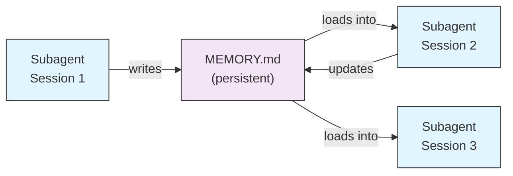
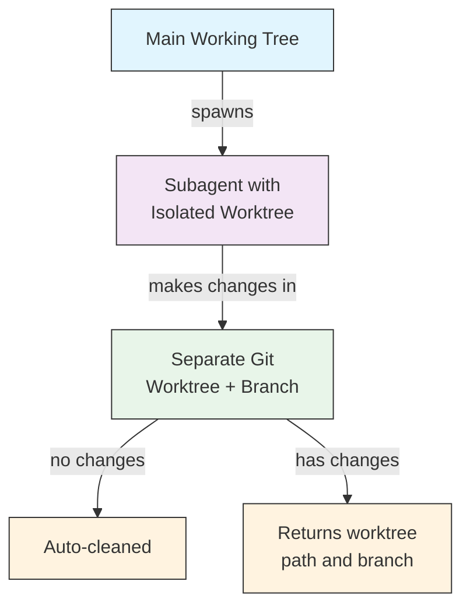
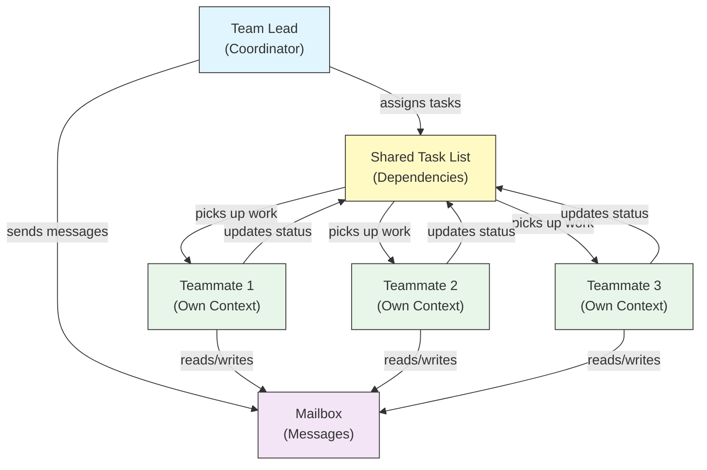
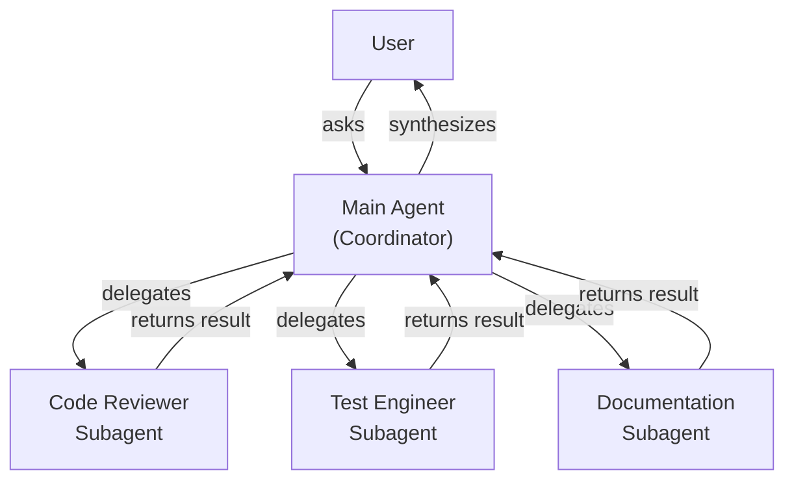
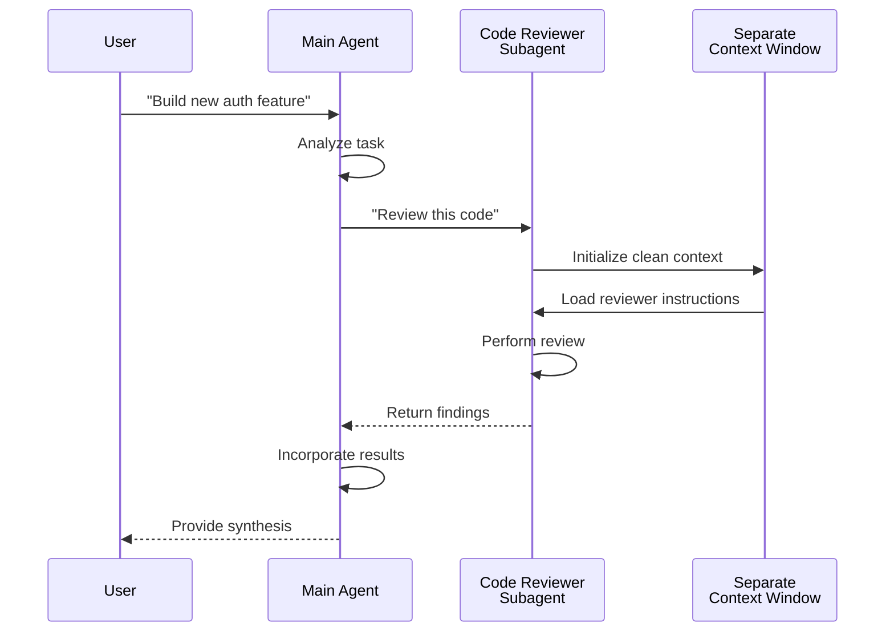
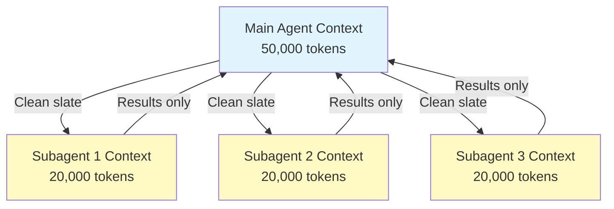
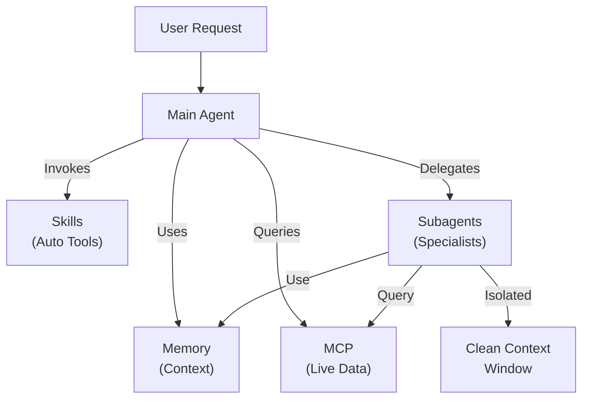

<picture>
  <source media="(prefers-color-scheme: dark)" srcset="../resources/logos/claude-howto-logo-dark.svg">
  
</picture>

# Subagents - 完整参考指南

Subagents是专门的 AI 助手，Claude Code 可以将任务委派给它们。每个Subagents都有特定的用途，使用与主对话分开的自己的上下文窗口，并且可以使用特定的工具和自定义系统提示进行配置。

## 目录

1.[Overview](#overview)
2.[Key Benefits](#key-benefits)
3.[File Locations](#file-locations)
4.[Configuration](#configuration)
5.[Built-in Subagents](#built-in-subagents)
6.[Managing Subagents](#managing-subagents)
7.[Using Subagents](#using-subagents)
8.[Resumable Agents](#resumable-agents)
9.[Chaining Subagents](#chaining-subagents)
10.[Persistent Memory for Subagents](#persistent-memory-for-subagents)
11.[Background Subagents](#background-subagents)
12.[Worktree Isolation](#worktree-isolation)
13.[Restrict Spawnable Subagents](#restrict-spawnable-subagents)
14.[`claude agents` CLI Command](#claude-agents-cli-command)
15.[Agent Teams (Experimental)](#agent-teams-experimental)
16.[Plugin Subagent Security](#plugin-subagent-security)
17.[Architecture](#architecture)
18.[Context Management](#context-management)
19.[When to Use Subagents](#when-to-use-subagents)
20.[Best Practices](#best-practices)
21.[Example Subagents in This Folder](#example-subagents-in-this-folder)
22.[Installation Instructions](#installation-instructions)
23.[Related Concepts](#related-concepts)

---

## 概述

Subagents通过以下方式在 Claude Code 中启用委派任务执行：

- 使用单独的上下文窗口创建**隔离的人工智能助手**
- 为专业知识提供**定制的系统提示**
- 实施**工具访问控制**以限制功能
- 防止复杂任务带来的**上下文污染**
- 启用多个专门任务的**并行执行**

每个Subagents都以干净的状态独立运行，仅接收其任务所需的特定上下文，然后将结果返回给主agents进行合成。

**快速入门**：使用 `/agents` 命令以交互方式创建、查看、编辑和管理您的Subagents。

---

## 主要优点

|效益 |描述 |
|---------|-------------|
| **上下文保存** |在单独的上下文中运行，防止主要对话的污染 |
| **专业知识** |针对特定领域进行微调，成功率更高 |
| **可重复使用性** |跨不同项目使用并与团队共享 |
| **灵活的权限** |不同Subagents类型的不同工具访问级别 |
| **可扩展性** |多个agents同时在不同方面工作 |

---

## 文件位置

Subagents文件可以存储在具有不同范围的多个位置：

|优先|类型 |地点 |范围 |
|----------|------|----------|--------|
| 1（最高）| **CLI 定义** |通过 `--agents` 标志 (JSON) |仅限会议 |
| 2 | **项目分agents** | `.claude/agents/` |当前项目 |
| 3 | **用户Subagents** | `~/.claude/agents/` |所有项目 |
| 4（最低）| **Pluginsagents** |Plugins `agents/` 目录 |通过Plugins |

当存在重复名称时，优先级较高的源优先。

---

## 配置

### 文件格式

Subagents在 YAML frontmatter 中定义，后跟 markdown 中的系统提示符：
```yaml
---
name: your-sub-agent-name
description: Description of when this subagent should be invoked
tools: tool1, tool2, tool3  # Optional - inherits all tools if omitted
disallowedTools: tool4  # Optional - explicitly disallowed tools
model: sonnet  # Optional - sonnet, opus, haiku, or inherit
permissionMode: default  # Optional - permission mode
maxTurns: 20  # Optional - limit agentic turns
skills: skill1, skill2  # Optional - skills to preload into context
mcpServers: server1  # Optional - MCP servers to make available
memory: user  # Optional - persistent memory scope (user, project, local)
background: false  # Optional - run as background task
effort: high  # Optional - reasoning effort (low, medium, high, max)
isolation: worktree  # Optional - git worktree isolation
initialPrompt: "Start by analyzing the codebase"  # Optional - auto-submitted first turn
hooks:  # Optional - component-scoped hooks
  PreToolUse:
    - matcher: "Bash"
      hooks:
        - type: command
          command: "./scripts/security-check.sh"
---

Your subagent's system prompt goes here. This can be multiple paragraphs
and should clearly define the subagent's role, capabilities, and approach
to solving problems.
```
### 配置字段

|领域 |必填|描述 |
|--------|----------|-------------|
| `name` |是的 |唯一标识符（小写字母和连字符）|
| `description` |是的 |目的的自然语言描述。包括“主动使用”以鼓励自动调用 |
| `tools` |没有 |以逗号分隔的特定工具列表。省略继承所有工具。支持 `Agent(agent_name)` 语法来限制可生成的Subagents |
| `disallowedTools` |没有 |Subagents不得使用的以逗号分隔的工具列表 |
| `model` |没有 |要使用的型号：`sonnet`、`opus`、`haiku`、完整型号 ID 或 `inherit`。默认为配置的Subagents模型 |
| `permissionMode` |没有 | `default`、`acceptEdits`、`dontAsk`、`bypassPermissions`、`plan` |
| `maxTurns` |没有 |Subagents可以进行的最大agents轮数 |
| `skills` |没有 |要预加载的以逗号分隔的skills列表。在启动时将完整的skills内容注入到Subagents的上下文中 |
| `mcpServers` |没有 |可供Subagents使用的 MCP 服务器 |
| `hooks` |没有 |组件范围的hooks（PreToolUse、PostToolUse、Stop）|
| `memory` |没有 |持久内存目录范围：`user`、`project` 或 `local` |
| `background` |没有 |设置为 `true` 以始终将此Subagents作为后台任务运行 |
| `effort` |没有 |推理努力水平：`low`、`medium`、`high` 或 `max` |
| `isolation` |没有 |设置为 `worktree` 以为Subagents提供自己的 git 工作树 |
| `initialPrompt` |没有 |当Subagents作为主agents运行时第一回合自动提交 |

### 工具配置选项

**选项 1：继承所有工具（省略该字段）**
```yaml
---
name: full-access-agent
description: Agent with all available tools
---
```
**选项 2：指定单独的工具**
```yaml
---
name: limited-agent
description: Agent with specific tools only
tools: Read, Grep, Glob, Bash
---
```
**选项 3：条件工具访问**
```yaml
---
name: conditional-agent
description: Agent with filtered tool access
tools: Read, Bash(npm:*), Bash(test:*)
---
```
### 基于 CLI 的配置

使用 JSON 格式的 `--agents` 标志为单个会话定义Subagents：
```bash
claude --agents '{
  "code-reviewer": {
    "description": "Expert code reviewer. Use proactively after code changes.",
    "prompt": "You are a senior code reviewer. Focus on code quality, security, and best practices.",
    "tools": ["Read", "Grep", "Glob", "Bash"],
    "model": "sonnet"
  }
}'
```
**`--agents` 标志的 JSON 格式：**
```json
{
  "agent-name": {
    "description": "Required: when to invoke this agent",
    "prompt": "Required: system prompt for the agent",
    "tools": ["Optional", "array", "of", "tools"],
    "model": "optional: sonnet|opus|haiku"
  }
}
```
**agents定义的优先级：**

agents定义按照以下优先顺序加载（第一个匹配获胜）：
1. **CLI 定义** - `--agents` 标志（仅限会话，JSON）
2. **项目级** - `.claude/agents/`（当前项目）
3. **用户级别** - `~/.claude/agents/`（所有项目）
4. **Plugins级** - Plugins`agents/`目录

这允许 CLI 定义覆盖单个会话的所有其他源。

---

## 内置Subagents

Claude Code 包含几个始终可用的内置Subagents：

|agents|型号|目的|
|--------|--------|---------|
| **通用** |继承|复杂、多步骤的任务 |
| **计划** |继承|计划模式研究|
| **探索** | haiku |只读代码库探索（快速/中等/非常彻底）|
| **Bash** |继承|单独上下文中的终端命令 |
| **状态线设置** | Sonnet|配置状态行 |
| **claude代码指南** | haiku |回答claude代码功能问题 |

### 通用Subagents

|物业 |价值|
|----------|--------|
| **型号** |继承自父母|
| **工具** |所有工具|
| **目的** |复杂的研究任务、多步骤操作、代码修改 |

**使用时**：需要通过复杂推理进行探索和修改的任务。

### 计划Subagents

|物业 |价值|
|----------|--------|
| **型号** |继承自父母|
| **工具** |阅读、Glob、Grep、Bash |
| **目的** |在计划模式下自动使用来研究代码库 |

**何时使用**：当 Claude 在提出计划之前需要了解代码库时。

### 探索Subagents

|物业 |价值|
|----------|--------|
| **型号** | Haiku（快速、低延迟）|
| **模式** |严格只读 |
| **工具** | Glob、Grep、Read、Bash（仅限只读命令）|
| **目的** |快速代码库搜索和分析 |

**使用时**：搜索/理解代码而不进行更改时。

**彻底程度** - 指定探索的深度：
- **“快速”** - 以最少的探索进行快速搜索，适合查找特定模式
- **“中”** - 适度探索，平衡速度和彻底性，默认方法
- **“非常彻底”** - 跨多个位置和命名约定的综合分析，可能需要更长的时间

### Bash Subagents

|物业 |价值|
|----------|--------|
| **型号** |继承自父母|
| **工具** |Bash |
| **目的** |在单独的上下文窗口中执行终端命令 |

**何时使用**：运行受益于隔离上下文的 shell 命令时。

### Statusline 设置Subagents

|物业 |价值|
|----------|--------|
| **型号** | Sonnet|
| **工具** |读、写、重击 |
| **目的** |配置Claude Code状态行显示|

**使用时**：设置或自定义状态行时。

### claude代码指南Subagents

|物业 |价值|
|----------|--------|
| **型号** | Haiku（快速、低延迟）|
| **工具** |只读|
| **目的** |回答有关 Claude Code 功能和用法的问题 |

**使用时**：当用户询问有关 Claude Code 如何工作或如何使用特定功能的问题时。

---

## 管理Subagents

### 使用 `/agents` 命令（推荐）
```bash
/agents
```
这提供了一个交互式菜单：
- 查看所有可用的Subagents（内置、用户和项目）
- 通过引导设置创建新的Subagents
- 编辑现有的自定义Subagents和工具访问
- 删除自定义Subagents
- 当存在重复项时查看哪些Subagents处于活动状态

### 直接文件管理
```bash
# Create a project subagent
mkdir -p .claude/agents
cat > .claude/agents/test-runner.md << 'EOF'
---
name: test-runner
description: Use proactively to run tests and fix failures
---

You are a test automation expert. When you see code changes, proactively
run the appropriate tests. If tests fail, analyze the failures and fix
them while preserving the original test intent.
EOF

# Create a user subagent (available in all projects)
mkdir -p ~/.claude/agents
```
---

## 使用Subagents

### 自动委派

claude根据以下因素主动委派任务：
- 您的请求中的任务描述
- Subagents配置中的 `description` 字段
- 当前环境和可用工具

为了鼓励主动使用，请在 `description` 字段中包含“主动使用”或“必须使用”：
```yaml
---
name: code-reviewer
description: Expert code review specialist. Use PROACTIVELY after writing or modifying code.
---
```
### 显式调用

您可以明确请求特定的Subagents：
```
> Use the test-runner subagent to fix failing tests
> Have the code-reviewer subagent look at my recent changes
> Ask the debugger subagent to investigate this error
```
### @-提及调用

使用 `@` 前缀来保证调用特定的Subagents（绕过自动委托启发式）：
```
> @"code-reviewer (agent)" review the auth module
```
### 会话范围agents

使用特定agents作为主要agents运行整个会话：
```bash
# Via CLI flag
claude --agent code-reviewer

# Via settings.json
{
  "agent": "code-reviewer"
}
```
### 列出可用的agents

使用 `claude agents` 命令列出所有来源的所有已配置agents：
```bash
claude agents
```
---

## 可恢复agents

Subagents可以继续之前的对话并保留完整的上下文：
```bash
# Initial invocation
> Use the code-analyzer agent to start reviewing the authentication module
# Returns agentId: "abc123"

# Resume the agent later
> Resume agent abc123 and now analyze the authorization logic as well
```
**用例**：
- 跨多个会议的长期研究
- 迭代细化而不丢失上下文
- 维护上下文的多步骤工作流程

---

## 链接Subagents

按顺序执行多个Subagents：
```bash
> First use the code-analyzer subagent to find performance issues,
  then use the optimizer subagent to fix them
```
这使得复杂的工作流程成为可能，其中一个Subagents的输出会输入到另一个Subagents中。

---

## Subagents的持久内存

`memory` 字段为Subagents提供了一个在对话中持续存在的持久目录。这使得Subagents能够随着时间的推移积累知识，存储会话之间持续存在的笔记、发现和上下文。

### 内存范围

|范围 |目录 |使用案例|
|--------|------------|----------|
| `user` | `~/.claude/agent-memory/<name>/` |所有项目的个人笔记和偏好|
| `project` | `.claude/agent-memory/<name>/` |与团队共享特定于项目的知识 |
| `local` | `.claude/agent-memory-local/<name>/` |本地项目知识不致力于版本控制|

### 它是如何运作的

- 内存目录中的前200行`MEMORY.md`会自动加载到Subagents的系统提示符中
- 自动启用 `Read`、`Write` 和 `Edit` 工具，以便Subagents管理其内存文件
- Subagents可以根据需要在其内存目录中创建其他文件

### 配置示例
```yaml
---
name: researcher
memory: user
---

You are a research assistant. Use your memory directory to store findings,
track progress across sessions, and build up knowledge over time.

Check your MEMORY.md file at the start of each session to recall previous context.
```


---

## 后台Subagents

Subagents可以在后台运行，从而腾出主要对话来执行其他任务。

### 配置

在 frontmatter 中设置 `background: true` 以始终将Subagents作为后台任务运行：
```yaml
---
name: long-runner
background: true
description: Performs long-running analysis tasks in the background
---
```
### 键盘快捷键

|快捷方式|行动|
|----------|--------|
| `Ctrl+B` |将当前正在运行的Subagents任务置于后台 |
| `Ctrl+F` |杀死所有后台特工（按两次确认）|

### 禁用后台任务

设置环境变量以完全禁用后台任务支持：
```bash
export CLAUDE_CODE_DISABLE_BACKGROUND_TASKS=1
```
---

## 工作树隔离

`isolation: worktree` 设置为Subagents提供了自己的 git 工作树，允许其独立进行更改而不影响主工作树。

＃＃＃ 配置
```yaml
---
name: feature-builder
isolation: worktree
description: Implements features in an isolated git worktree
tools: Read, Write, Edit, Bash, Grep, Glob
---
```
### 它是如何运作的

- Subagents在单独分支上的自己的 git 工作树中运行
- 如果Subagents没有进行任何更改，工作树将自动清理
- 如果存在更改，工作树路径和分支名称将返回给主agents进行审查或合并

---

## 限制可生成的Subagents

您可以通过使用 `tools` 字段中的 `Agent(agent_type)` 语法来控制允许给定Subagents生成哪些Subagents。这提供了一种将特定Subagents列入白名单以进行委派的方法。

> **注意**：在 v2.1.63 中，`Task` 工具已重命名为 `Agent`。现有的 `Task(...)` 引用仍可用作别名。

＃＃＃ 例子
```yaml
---
name: coordinator
description: Coordinates work between specialized agents
tools: Agent(worker, researcher), Read, Bash
---

You are a coordinator agent. You can delegate work to the "worker" and
"researcher" subagents only. Use Read and Bash for your own exploration.
```
在此示例中，`coordinator` Subagents只能生成 `worker` 和 `researcher` Subagents。它不能生成任何其他Subagents，即使它们是在其他地方定义的。

---

## `claude agents` CLI 命令

`claude agents` 命令列出按源（内置、用户级、项目级）分组的所有已配置agents：
```bash
claude agents
```
这个命令：
- 显示所有来源的所有可用agents
- 按源位置对agents进行分组
- 表示当较高优先级的agents隐藏较低优先级的agents时**覆盖**（例如，与用户级agents同名的项目级agents）

---

## agents团队（实验）

agents团队协调多个 Claude Code 实例一起处理复杂的任务。与Subagents（返回结果的委派子任务）不同，团队成员根据自己的上下文独立工作，并通过共享邮箱系统直接通信。

> **注意**：Agent Teams 是实验性的，需要 Claude Code v2.1.32+。使用前启用它。

### Subagents与agents团队

|方面|Subagents |agents团队|
|--------|------------|-------------|
| **委托模型** |父级委托子任务，等待结果 |团队领导分配工作，队友独立执行 |
| **背景** |每个子任务都有新鲜的背景，提炼出的结果 |每个队友都维护自己的持久上下文 |
| **协调** |顺序或并行，由父级管理 |具有自动依赖性管理的共享任务列表|
| **通讯** |仅返回值 |通过邮箱进行agents间消息传递 |
| **会议恢复** |支持 |不支持进程中的队友 |
| **最适合** |重点突出、定义明确的子任务 |需要并行工作的大型多文件项目|

### 启用agents团队

设置环境变量或将其添加到您的 `settings.json`：
```bash
export CLAUDE_CODE_EXPERIMENTAL_AGENT_TEAMS=1
```
或者在 `settings.json` 中：
```json
{
  "env": {
    "CLAUDE_CODE_EXPERIMENTAL_AGENT_TEAMS": "1"
  }
}
```
### 组建团队

启用后，请claude在提示中与队友合作：
```
User: Build the authentication module. Use a team — one teammate for the API endpoints,
      one for the database schema, and one for the test suite.
```
Claude 将自动创建团队、分配任务并协调工作。

### 显示模式

控制队友活动的显示方式：

|模式|旗帜|描述 |
|------|------|-------------|
| **自动** | `--teammate-mode auto` |自动为您的终端选择最佳显示模式 |
| **进行中** | `--teammate-mode in-process` |在当前终端中内联显示队友输出（默认） |
| **分割窗格** | `--teammate-mode tmux` |在单独的 tmux 或 iTerm2 窗格中打开每个队友 |
```bash
claude --teammate-mode tmux
```
您还可以在`settings.json`中设置显示模式：
```json
{
  "teammateMode": "tmux"
}
```
> **注意**：分割窗格模式需要 tmux 或 iTerm2。它在 VS Code 终端、Windows 终端或 Ghostty 中不可用。

### 导航

使用 `Shift+Down` 在分割窗格模式下在队友之间导航。

### 团队配置

团队配置存储在 `~/.claude/teams/{team-name}/config.json` 中。

＃＃＃ 建筑学

**关键组件**：

- **团队负责人**：主要的claude代码会话，用于创建团队、分配任务和协调
- **共享任务列表**：具有自动依赖性跟踪的同步任务列表
- **邮箱**：agents间消息传递系统，供队友交流状态和协调
- **队友**：独立的 Claude Code 实例，每个实例都有自己的上下文窗口

### 任务分配和消息传递

团队领导将工作分解为任务并将其分配给队友。共享任务列表处理：

- **自动依赖关系管理** — 任务等待其依赖关系完成
- **状态跟踪** — 队友在工作时更新任务状态
- **agents间消息传递** - 队友通过邮箱发送消息进行协调（例如，“数据库架构已准备就绪，您可以开始编写查询”）

### 计划审批工作流程

对于复杂的任务，团队负责人会在队友开始工作之前创建执行计划。用户审查并批准该计划，确保团队的方法在进行任何代码更改之前符合预期。

### 团队hooks活动

特工团队引入了两个额外的 [hook events](../06-hooks/)：

|活动 |何时触发 |使用案例|
|--------|------------|----------|
| `TeammateIdle` |队友完成当前任务并且没有待处理的工作 |触发通知，分配后续任务 |
| `TaskCompleted` |共享任务列表中的任务被标记为完成 |运行验证、更新仪表板、链相关工作 |

### 最佳实践

- **团队规模**：将团队保持在 3-5 名队友，以实现最佳协调
- **任务大小调整**：将工作分解为每个任务需要 5-15 分钟的任务 — 小到足以并行化，大到足以有意义
- **避免文件冲突**：将不同的文件或目录分配给不同的队友，以防止合并冲突
- **从简单开始**：为您的第一个团队使用进程内模式；一旦感觉舒服就切换到分割窗格
- **清晰的任务描述**：提供具体的、可操作的任务描述，以便团队成员可以独立工作

### 限制

- **实验性**：功能行为可能会在未来版本中发生变化
- **无法恢复会话**：会话结束后，进程中的队友无法恢复
- **每个会话一个团队**：无法在单个会话中创建嵌套团队或多个团队
- **固定领导**：团队领导角色不能转移给队友
- **分割窗格限制**：需要 tmux/iTerm2；在 VS Code 终端、Windows 终端或 Ghostty 中不可用
- **没有跨会话团队**：队友仅存在于当前会话中

> **警告**：Agent Teams 处于实验阶段。首先测试非关键工作，并监控队友的协调是否出现意外行为。

---

## PluginsSubagents安全

为了安全起见，Plugins提供的Subagents具有有限的 frontmatter 功能。PluginsSubagents定义中**不允许**以下字段：

- `hooks` - 无法定义生命周期hooks
- `mcpServers` - 无法配置 MCP 服务器
- `permissionMode` - 无法覆盖权限设置

这可以防止Plugins升级权限或通过Subagentshooks执行任意命令。

---

## 架构

### 高级架构

### Subagents生命周期

---

## 上下文管理

### 要点

- 每个Subagents都会获得一个**新的上下文窗口**，而没有主要对话历史记录
- 仅将**相关上下文**传递给Subagents以执行其特定任务
- 结果被**蒸馏**返回给主要agents
- 这可以防止长期项目中的**上下文Token耗尽**

### 性能考虑因素

- **上下文效率** - agents保留主要上下文，从而实现更长的会话
- **延迟** - Subagents从干净的状态开始，可能会增加收集初始上下文的延迟

### 关键行为

- **无嵌套生成** - Subagents无法生成其他Subagents
- **后台权限** - 后台Subagents自动拒绝任何未经预先批准的权限
- **后台运行** - 按 `Ctrl+B` 将当前正在运行的任务置于后台运行
- **成绩单** - Subagents成绩单存储在 `~/.claude/projects/{project}/{sessionId}/subagents/agent-{agentId}.jsonl`
- **自动压缩** - Subagents上下文以约 95% 的容量自动压缩（使用 `CLAUDE_AUTOCOMPACT_PCT_OVERRIDE` 环境变量覆盖）

---

## 何时使用Subagents

|场景 |使用Subagents |为什么 |
|----------|--------------|-----|
|具有多个步骤的复杂功能 |是的 |分离关注点，防止上下文污染 |
|快速代码审查 |没有 |不必要的开销|
|并行任务执行|是的 |每个Subagents都有自己的上下文 |
|需要专业知识 |是的 |自定义系统提示|
|长期运行分析 |是的 |防止主上下文耗尽 |
|单任务 |没有 |不必要地增加延迟 |

---

## 最佳实践

### 设计原则

**做：**
- 从 Claude 生成的agents开始 - 使用 Claude 生成初始Subagents，然后迭代进行自定义
- 设计重点Subagents - 单一、明确的职责，而不是一个人包揽一切
- 编写详细的提示 - 包括具体说明、示例和约束
- 限制工具访问 - 仅授予Subagents所需的必要工具
- 版本控制 - 将项目Subagents检查到版本控制中以进行团队协作

**不要：**
- 创建具有相同角色的重叠Subagents
- 授予Subagents不必要的工具访问权限
- 使用Subagents执行简单的单步任务
- 在一个Subagents的提示中混合关注点
- 忘记传递必要的上下文

### 系统提示最佳实践

1. **具体说明角色**
   ```
   You are an expert code reviewer specializing in [specific areas]
   ```
2. **明确定义优先事项**
   ```
   Review priorities (in order):
   1. Security Issues
   2. Performance Problems
   3. Code Quality
   ```
3. **指定输出格式**
   ```
   For each issue provide: Severity, Category, Location, Description, Fix, Impact
   ```
4. **包括行动步骤**
   ```
   When invoked:
   1. Run git diff to see recent changes
   2. Focus on modified files
   3. Begin review immediately
   ```
### 工具访问策略

1. **开始限制性**：仅从必要的工具开始
2. **仅在需要时扩展**：根据需求添加工具
3. **尽可能只读**：使用 Read/Grep 进行分析agents
4. **沙盒执行**：将 Bash 命令限制为特定模式

---

## 此文件夹中的Subagents示例

此文件夹包含现成的示例Subagents：

### 1. 代码审查员 (`code-reviewer.md`)

**目的**：全面的代码质量和可维护性分析

**工具**：Read、Grep、Glob、Bash

**专业**：
- 安全漏洞检测
- 性能优化识别
- 代码可维护性评估
- 测试覆盖率分析

**使用时间**：您需要自动代码审查，重点关注质量和安全性

---

### 2. 测试工程师 (`test-engineer.md`)

**目的**：测试策略、覆盖率分析和自动化测试

**工具**：读、写、Bash、Grep

**专业**：
- 单元测试创建
- 集成测试设计
- 边缘情况识别
- 覆盖率分析（>80% 目标）

**使用时间**：您需要全面的测试套件创建或覆盖率分析

---

### 3. 文档编写者 (`documentation-writer.md`)

**目的**：技术文档、API 文档和用户指南

**工具**：读取、写入、Grep

**专业**：
- API端点文档
- 用户指南创建
- 架构文档
- 代码注释改进

**使用时**：您需要创建或更新项目文档

---

### 4. 安全审核员 (`secure-reviewer.md`)

**目的**：以最小权限进行以安全为中心的代码审查

**工具**：阅读、Grep

**专业**：
- 安全漏洞检测
- 身份验证/授权问题
- 数据暴露风险
- 注入攻击识别

**使用时**：您需要安全审核而无需修改功能

---

### 5. 实施agents (`implementation-agent.md`)

**目的**：功能开发的完整实现能力

**工具**：读取、写入、编辑、Bash、Grep、Glob

**专业**：
- 功能实现
- 代码生成
- 构建和测试执行
- 代码库修改

**使用时间**：您需要一个Subagents来实现端到端的功能

---

### 6. 调试器 (`debugger.md`)

**用途**：错误、测试失败和意外行为的调试专家

**工具**：读取、编辑、Bash、Grep、Glob

**专业**：
- 根本原因分析
- 错误调查
- 测试失败解决方案
- 最小修复实施

**使用时**：您遇到错误、错误或意外行为

---

### 7. 数据科学家 (`data-scientist.md`)

**目的**：SQL查询和数据洞察的数据分析专家

**工具**：Bash、读取、写入

**专业**：
- SQL查询优化
- BigQuery 操作
- 数据分析和可视化
- 统计见解

**使用时**：您需要数据分析、SQL 查询或 BigQuery 操作

---

## 安装说明

### 方法1：使用/agents命令（推荐）
```bash
/agents
```
然后：
1. 选择“创建新agents”
2. 选择项目级或用户级
3. 详细描述您的Subagents
4. 选择授予访问权限的工具（或留空以继承全部）
5.保存并使用

### 方法2：复制到项目

将agents文件复制到项目的 `.claude/agents/` 目录：
```bash
# Navigate to your project
cd /path/to/your/project

# Create agents directory if it doesn't exist
mkdir -p .claude/agents

# Copy all agent files from this folder
cp /path/to/04-subagents/*.md .claude/agents/

# Remove the README (not needed in .claude/agents)
rm .claude/agents/README.md
```
### 方法3：复制到用户目录

对于您所有项目中可用的agents：
```bash
# Create user agents directory
mkdir -p ~/.claude/agents

# Copy agents
cp /path/to/04-subagents/code-reviewer.md ~/.claude/agents/
cp /path/to/04-subagents/debugger.md ~/.claude/agents/
# ... copy others as needed
```
### 验证

安装后，验证agents是否被识别：
```bash
/agents
```
您应该会看到已安装的agents与内置agents一起列出。

---

## 文件结构
```
project/
├── .claude/
│   └── agents/
│       ├── code-reviewer.md
│       ├── test-engineer.md
│       ├── documentation-writer.md
│       ├── secure-reviewer.md
│       ├── implementation-agent.md
│       ├── debugger.md
│       └── data-scientist.md
└── ...
```
---

## 相关概念

### 相关功能

- **[Slash Commands](../01-slash-commands/)** - 用户快速调用的快捷方式
- **[Memory](../02-memory/)** - 持久跨会话上下文
- **[Skills](../03-skills/)** - 可重复使用的自主功能
- **[MCP Protocol](../05-mcp/)** - 实时外部数据访问
- **[Hooks](../06-hooks/)** - 事件驱动的 shell 命令自动化
- **[Plugins](../07-plugins/)** - 捆绑的扩展包

### 与其他功能的比较

|特色|用户调用|自动调用 |坚持不懈|外部访问|孤立的背景|
|--------|--------------|--------------|------------------------|------------------|--------------------|
| **斜线命令** |是的 |没有 |没有 |没有 |没有 |
| **Subagents** |是的 |是的 |没有 |没有 |是的 |
| **内存** |汽车 |汽车 |是的 |没有 |没有 |
| **MCP** |汽车 |是的 |没有 |是的 |没有 |
| **skills** |是的 |是的 |没有 |没有 |没有 |

### 集成模式

---

## 其他资源

- [Official Subagents Documentation](https://code.claude.com/docs/en/sub-agents)
- [CLI Reference](https://code.claude.com/docs/en/cli-reference) - `--agents` 标志和其他 CLI 选项
- [Plugins Guide](../07-plugins/) - 用于具有其他功能的捆绑agents
- [Skills Guide](../03-skills/) - 用于自动调用的功能
- [Memory Guide](../02-memory/) - 用于持久上下文
- [Hooks Guide](../06-hooks/) - 用于事件驱动的自动化

---

*最后更新时间：2026 年 3 月*

*本指南涵盖了 Claude Code 的完整Subagents配置、委派模式和最佳实践。*
