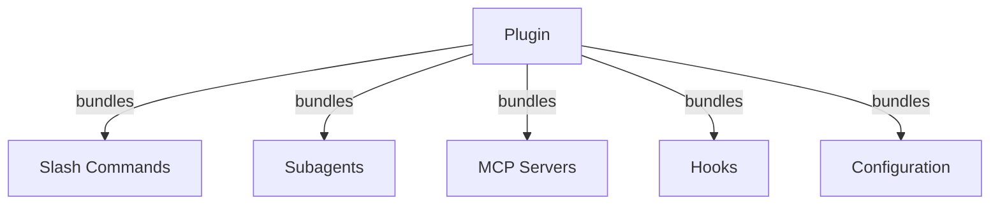
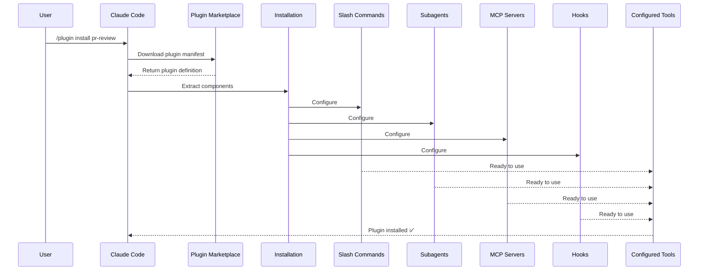
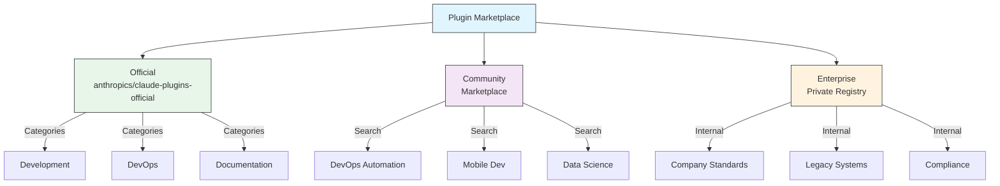
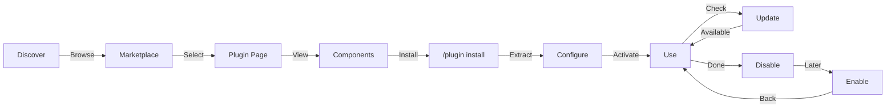
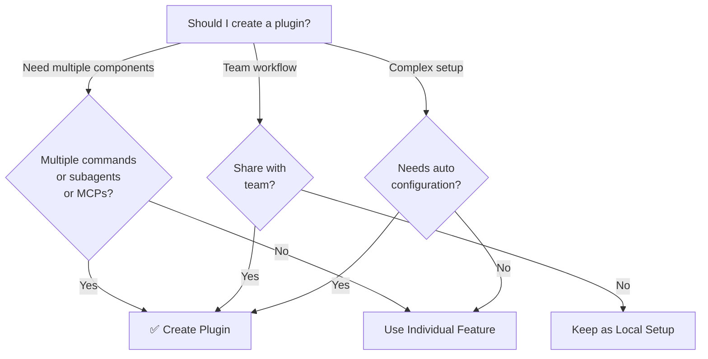

<picture>
  <source media="(prefers-color-scheme: dark)" srcset="../resources/logos/claude-howto-logo-dark.svg">
  
</picture>

# claude代码Plugins

此文件夹包含完整的Plugins示例，将多个 Claude Code 功能捆绑到内聚的可安装包中。

## 概述

Claude 代码Plugins是使用单个命令安装的自定义项（斜线命令、Subagents、MCP 服务器和hooks）的捆绑集合。它们代表了最高级别的扩展机制——将多个功能组合成有凝聚力的、可共享的包。

## Plugins架构

## Plugins加载过程

## Plugins类型和分布

|类型 |范围 |共享|权威|示例 |
|------|--------|--------|------------|----------|
|官方|全球|所有用户|人择 |公关审查、安全指南 |
|社区 |公共|所有用户|社区 | DevOps、数据科学 |
|组织|内部|团队成员 |公司 |内部标准、工具|
|个人|个人|单用户|开发商|自定义工作流程 |

## Plugins定义结构

Plugins清单在 `.claude-plugin/plugin.json` 中使用 JSON 格式：
```json
{
  "name": "my-first-plugin",
  "description": "A greeting plugin",
  "version": "1.0.0",
  "author": {
    "name": "Your Name"
  },
  "homepage": "https://example.com",
  "repository": "https://github.com/user/repo",
  "license": "MIT"
}
```
## Plugins结构示例
```
my-plugin/
├── .claude-plugin/
│   └── plugin.json       # Manifest (name, description, version, author)
├── commands/             # Skills as Markdown files
│   ├── task-1.md
│   ├── task-2.md
│   └── workflows/
├── agents/               # Custom agent definitions
│   ├── specialist-1.md
│   ├── specialist-2.md
│   └── configs/
├── skills/               # Agent Skills with SKILL.md files
│   ├── skill-1.md
│   └── skill-2.md
├── hooks/                # Event handlers in hooks.json
│   └── hooks.json
├── .mcp.json             # MCP server configurations
├── .lsp.json             # LSP server configurations
├── settings.json         # Default settings
├── templates/
│   └── issue-template.md
├── scripts/
│   ├── helper-1.sh
│   └── helper-2.py
├── docs/
│   ├── README.md
│   └── USAGE.md
└── tests/
    └── plugin.test.js
```
### LSP服务器配置

Plugins可以包括对实时代码智能的语言服务器协议 (LSP) 支持。 LSP 服务器在您工作时提供诊断、代码导航和符号信息。

**配置位置**：
- Plugins根目录下的`.lsp.json`文件
- 内联 `lsp` 键输入 `plugin.json`

#### 字段参考

|领域 |必填|描述 |
|--------|----------|-------------|
| `command` |是的 | LSP 服务器二进制文件（必须位于 PATH 中）|
| `extensionToLanguage` |是的 |将文件扩展名映射到语言 ID |
| `args` |没有 |服务器的命令行参数 |
| `transport` |没有 |通讯方式：`stdio`（默认）或`socket` |
| `env` |没有 |服务器进程的环境变量 |
| `initializationOptions` |没有 | LSP 初始化期间发送的选项
| `settings` |没有 |工作区配置传递到服务器 |
| `workspaceFolder` |没有 |覆盖工作区文件夹路径 |
| `startupTimeout` |没有 |等待服务器启动的最长时间（毫秒）|
| `shutdownTimeout` |没有 |正常关闭的最长时间（毫秒）|
| `restartOnCrash` |没有 |服务器崩溃时自动重启 |
| `maxRestarts` |没有 |放弃之前的最大重新启动尝试次数 |

#### 配置示例

**去（gopls）**：
```json
{
  "go": {
    "command": "gopls",
    "args": ["serve"],
    "extensionToLanguage": {
      ".go": "go"
    }
  }
}
```
**Python（版权所有）**：
```json
{
  "python": {
    "command": "pyright-langserver",
    "args": ["--stdio"],
    "extensionToLanguage": {
      ".py": "python",
      ".pyi": "python"
    }
  }
}
```
**打字稿**：
```json
{
  "typescript": {
    "command": "typescript-language-server",
    "args": ["--stdio"],
    "extensionToLanguage": {
      ".ts": "typescript",
      ".tsx": "typescriptreact",
      ".js": "javascript",
      ".jsx": "javascriptreact"
    }
  }
}
```
#### 可用的 LSP Plugins

官方市场包括预配置的 LSP Plugins：

|Plugins |语言 |服务器二进制 |安装命令 |
|--------|----------|----------------|----------------|
| `pyright-lsp` |蟒蛇 | `pyright-langserver` | `pip install pyright` |
| `typescript-lsp` | TypeScript/JavaScript | `typescript-language-server` | `npm install -g typescript-language-server typescript` |
| `rust-lsp` |铁锈| `rust-analyzer` |通过 `rustup component add rust-analyzer` 安装 |

#### LSP 功能

配置完成后，LSP 服务器提供：

- **即时诊断** — 编辑后立即出现错误和警告
- **代码导航** — 转到定义、查找引用、实现
- **悬停信息** — 悬停时的类型签名和文档
- **符号列表** — 浏览当前文件或工作区中的符号

## Plugins选项 (v2.1.83+)

Plugins可以通过 `userConfig` 在清单中声明用户可配置的选项。标记为 `sensitive: true` 的值存储在系统钥匙串中，而不是存储在纯文本设置文件中：
```json
{
  "name": "my-plugin",
  "version": "1.0.0",
  "userConfig": {
    "apiKey": {
      "description": "API key for the service",
      "sensitive": true
    },
    "region": {
      "description": "Deployment region",
      "default": "us-east-1"
    }
  }
}
```
## 持久Plugins数据 (`${CLAUDE_PLUGIN_DATA}`) (v2.1.78+)

Plugins可以通过 `${CLAUDE_PLUGIN_DATA}` 环境变量访问持久状态目录。该目录对于每个Plugins都是唯一的，并且在会话之间存在，使其适合缓存、数据库和其他持久状态：
```json
{
  "hooks": {
    "PostToolUse": [
      {
        "command": "node ${CLAUDE_PLUGIN_DATA}/track-usage.js"
      }
    ]
  }
}
```
安装Plugins时会自动创建该目录。此处存储的文件将持续存在，直到Plugins被卸载为止。

## 通过设置内联Plugins (`source: 'settings'`) (v2.1.80+)

可以使用 `source: 'settings'` 字段在设置文件中将Plugins内联定义为市场条目。这允许直接嵌入Plugins定义，而不需要单独的存储库或市场：
```json
{
  "pluginMarketplaces": [
    {
      "name": "inline-tools",
      "source": "settings",
      "plugins": [
        {
          "name": "quick-lint",
          "source": "./local-plugins/quick-lint"
        }
      ]
    }
  ]
}
```
## Plugins设置

Plugins可以发送 `settings.json` 文件来提供默认配置。目前支持 `agent` 键，它设置Plugins的主线程agents：
```json
{
  "agent": "agents/specialist-1.md"
}
```
当Plugins包含 `settings.json` 时，其默认值将在安装时应用。用户可以在自己的项目或用户配置中覆盖这些设置。

## 独立方法与Plugins方法

|方法|命令名称 |配置|最适合 |
|----------|----------------|---|---|
| **独立** | `/hello` | CLAUDE.md 中的手动设置 |个人、特定项目|
| **Plugins** | `/plugin-name:hello` |通过plugin.json 自动化 |共享、分发、团队使用 |

使用**独立斜线命令**来实现快速的个人工作流程。当您想要捆绑多个功能、与团队共享或发布以进行分发时，请使用 **Plugins**。

## 实际例子

### 示例 1：PR 审核Plugins

**文件：** `.claude-plugin/plugin.json`
```json
{
  "name": "pr-review",
  "version": "1.0.0",
  "description": "Complete PR review workflow with security, testing, and docs",
  "author": {
    "name": "Anthropic"
  },
  "repository": "https://github.com/anthropic/pr-review",
  "license": "MIT"
}
```
**文件：** `commands/review-pr.md`
```markdown
---
name: Review PR
description: Start comprehensive PR review with security and testing checks
---

# PR Review

This command initiates a complete pull request review including:

1. Security analysis
2. Test coverage verification
3. Documentation updates
4. Code quality checks
5. Performance impact assessment
```
**文件：** `agents/security-reviewer.md`
```yaml
---
name: security-reviewer
description: Security-focused code review
tools: read, grep, diff
---

# Security Reviewer

Specializes in finding security vulnerabilities:
- Authentication/authorization issues
- Data exposure
- Injection attacks
- Secure configuration
```
**安装：**
```bash
/plugin install pr-review

# Result:
# ✅ 3 slash commands installed
# ✅ 3 subagents configured
# ✅ 2 MCP servers connected
# ✅ 4 hooks registered
# ✅ Ready to use!
```
### 示例 2：DevOps Plugins

**组件：**
```
devops-automation/
├── commands/
│   ├── deploy.md
│   ├── rollback.md
│   ├── status.md
│   └── incident.md
├── agents/
│   ├── deployment-specialist.md
│   ├── incident-commander.md
│   └── alert-analyzer.md
├── mcp/
│   ├── github-config.json
│   ├── kubernetes-config.json
│   └── prometheus-config.json
├── hooks/
│   ├── pre-deploy.js
│   ├── post-deploy.js
│   └── on-error.js
└── scripts/
    ├── deploy.sh
    ├── rollback.sh
    └── health-check.sh
```
### 示例 3：文档Plugins

**捆绑组件：**
```
documentation/
├── commands/
│   ├── generate-api-docs.md
│   ├── generate-readme.md
│   ├── sync-docs.md
│   └── validate-docs.md
├── agents/
│   ├── api-documenter.md
│   ├── code-commentator.md
│   └── example-generator.md
├── mcp/
│   ├── github-docs-config.json
│   └── slack-announce-config.json
└── templates/
    ├── api-endpoint.md
    ├── function-docs.md
    └── adr-template.md
```
## Plugins市场

Anthropic 管理的官方Plugins目录是 `anthropics/claude-plugins-official`。企业管理员还可以创建用于内部分发的私人Plugins市场。

### 市场配置

企业和高级用户可以通过设置控制市场行为：

|设置|描述 |
|---------|-------------|
| `extraKnownMarketplaces` |添加默认之外的其他市场来源 |
| `strictKnownMarketplaces` |控制允许用户添加哪些市场 |
| `deniedPlugins` |管理员管理的阻止列表可防止安装特定Plugins |

### 额外的市场功能

- **默认 git 超时**：对于大型Plugins存储库，从 30 秒增加到 120 秒
- **自定义 npm 注册表**：Plugins可以指定自定义 npm 注册表 URL 以进行依赖项解析
- **版本固定**：将Plugins锁定到特定版本以实现可重现的环境

### 市场定义架构

Plugins市场在 `.claude-plugin/marketplace.json` 中定义：
```json
{
  "name": "my-team-plugins",
  "owner": "my-org",
  "plugins": [
    {
      "name": "code-standards",
      "source": "./plugins/code-standards",
      "description": "Enforce team coding standards",
      "version": "1.2.0",
      "author": "platform-team"
    },
    {
      "name": "deploy-helper",
      "source": {
        "source": "github",
        "repo": "my-org/deploy-helper",
        "ref": "v2.0.0"
      },
      "description": "Deployment automation workflows"
    }
  ]
}
```
|领域 |必填|描述 |
|--------|----------|-------------|
| `name` |是的 | kebab-case 中的市场名称 |
| `owner` |是的 |维护市场的组织或用户|
| `plugins` |是的 |Plugins条目数组 |
| `plugins[].name` |是的 |Plugins名称（kebab-case）|
| `plugins[].source` |是的 |Plugins源（路径字符串或源对象）|
| `plugins[].description` |没有 |Plugins简介 |
| `plugins[].version` |没有 |语义版本字符串 |
| `plugins[].author` |没有 |Plugins作者姓名 |

### Plugins源类型

Plugins可以从多个位置获取：

|来源 |语法 |示例|
|--------|--------|---------|
| **相对路径** |字符串路径 | `"./plugins/my-plugin"` |
| **GitHub** | `{ "source": "github", "repo": "owner/repo" }` | `{ "source": "github", "repo": "acme/lint-plugin", "ref": "v1.0" }` |
| **Git 网址** | `{ "source": "url", "url": "..." }` | `{ "source": "url", "url": "https://git.internal/plugin.git" }` |
| **Git 子目录** | `{ "source": "git-subdir", "url": "...", "path": "..." }` | `{ "source": "git-subdir", "url": "https://github.com/org/monorepo.git", "path": "packages/plugin" }` |
| **npm** | `{ "source": "npm", "package": "..." }` | `{ "source": "npm", "package": "@acme/claude-plugin", "version": "^2.0" }` |
| **点** | `{ "source": "pip", "package": "..." }` | `{ "source": "pip", "package": "claude-data-plugin", "version": ">=1.0" }` |

GitHub 和 git 源支持可选的 `ref` （分支/标签）和 `sha` （提交哈希）字段进行版本固定。

### 分配方式

**GitHub（推荐）**：
```bash
# Users add your marketplace
/plugin marketplace add owner/repo-name
```
**其他 git 服务**（需要完整的 URL）：
```bash
/plugin marketplace add https://gitlab.com/org/marketplace-repo.git
```
**私有存储库**：通过 git 凭证助手或环境Token支持。用户必须具有存储库的读取权限。

**官方市场提交**：将Plugins提交到 Anthropic 策划的市场以进行更广泛的分发。

### 严格模式

控制市场定义如何与本地 `plugin.json` 文件交互：

|设置|行为 |
|---------|----------|
| `strict: true`（默认）|本地`plugin.json`具有权威性；市场准入对其进行补充|
| `strict: false` |市场入口是整个Plugins定义 |

**组织限制** 与 `strictKnownMarketplaces`：

|价值|效果|
|--------|--------|
|未设置|无限制 — 用户可以添加任何市场 |
|空数组 `[]` |封锁——不允许任何市场|
|图案数组 |白名单 — 只能添加匹配的市场 |
```json
{
  "strictKnownMarketplaces": [
    "my-org/*",
    "github.com/trusted-vendor/*"
  ]
}
```
> **警告**：在 `strictKnownMarketplaces` 的严格模式下，用户只能安装来自允许列表的市场的Plugins。这对于需要受控Plugins分发的企业环境非常有用。

## Plugins安装和生命周期

## Plugins功能比较

|特色|斜线命令 |skills|Subagents |Plugins |
|--------|-------------|--------|---------|--------|
| **安装** |手动复制 |手动复制 |手动配置 |一个命令 |
| **设置时间** | 5 分钟 | 10 分钟 | 15 分钟 | 2 分钟 |
| **捆绑** |单文件|单文件|单文件|多个|
| **版本控制** |手册|手册|手册|自动|
| **团队分享** |复制文件|复制文件|复制文件|安装ID |
| **更新** |手册|手册|手册|自动可用 |
| **依赖关系** |无 |无 |无 |可能包括|
| **市场** |没有 |没有 |没有 |是的 |
| **分布** |存储库 |存储库 |存储库 |市场|

## Plugins CLI 命令

所有Plugins操作都可以作为 CLI 命令使用：
```bash
claude plugin install <name>@<marketplace>   # Install from a marketplace
claude plugin uninstall <name>               # Remove a plugin
claude plugin list                           # List installed plugins
claude plugin enable <name>                  # Enable a disabled plugin
claude plugin disable <name>                 # Disable a plugin
claude plugin validate                       # Validate plugin structure
```
## 安装方法

### 来自市场
```bash
/plugin install plugin-name
# or from CLI:
claude plugin install plugin-name@marketplace-name
```
### 启用/禁用（自动检测范围）
```bash
/plugin enable plugin-name
/plugin disable plugin-name
```
### 本地Plugins（用于开发）
```bash
# CLI flag for local testing (repeatable for multiple plugins)
claude --plugin-dir ./path/to/plugin
claude --plugin-dir ./plugin-a --plugin-dir ./plugin-b
```
### 来自 Git 存储库
```bash
/plugin install github:username/repo
```
## 何时创建Plugins

### Plugins用例

|使用案例|推荐|为什么 |
|----------|-----------------|-----|
| **团队入职** | ✅ 使用Plugins |即时设置，所有配置 |
| **框架设置** | ✅ 使用Plugins |捆绑特定于框架的命令 |
| **企业标准** | ✅ 使用Plugins |集中分发、版本控制 |
| **快速任务自动化** | ❌ 使用命令 |过于复杂 |
| **单领域专业知识** | ❌使用skills|太重了，改用技巧|
| **专业分析** | ❌ 使用Subagents |手动创建或使用skills |
| **实时数据访问** | ❌ 使用 MCP |独立，请勿捆绑 |

## 测试Plugins

在发布之前，使用 `--plugin-dir` CLI 标志在本地测试您的Plugins（对于多个Plugins可重复）：
```bash
claude --plugin-dir ./my-plugin
claude --plugin-dir ./my-plugin --plugin-dir ./another-plugin
```
这将启动 Claude Code 并加载您的Plugins，允许您：
- 验证所有斜杠命令都可用
- 测试Subagents和agents功能是否正常
- 确认MCP服务器连接正确
- 验证Hook执行
- 检查LSP服务器配置
- 检查是否有任何配置错误

## 热重载

Plugins支持开发过程中的热重载。当您修改Plugins文件时，Claude Code 可以自动检测更改。您还可以使用以下命令强制重新加载：
```bash
/reload-plugins
```
这将重新读取所有Plugins清单、命令、agents、skills、hooks和 MCP/LSP 配置，而无需重新启动会话。

## Plugins的托管设置

管理员可以使用托管设置控制整个组织的Plugins行为：

|设置|描述 |
|---------|-------------|
| `enabledPlugins` |默认启用的Plugins白名单 |
| `deniedPlugins` |无法安装的Plugins黑名单 |
| `extraKnownMarketplaces` |添加默认之外的其他市场来源 |
| `strictKnownMarketplaces` |限制允许用户添加哪些市场 |
| `allowedChannelPlugins` |控制每个发布通道允许使用哪些Plugins |

这些设置可以通过托管配置文件在组织级别应用，并优先于用户级别设置。

## Plugins安全

PluginsSubagents在受限沙箱中运行。在PluginsSubagents定义中**不允许**以下 frontmatter 键：

- `hooks` -- Subagents无法注册事件处理程序
- `mcpServers` -- Subagents无法配置 MCP 服务器
- `permissionMode` -- Subagents不能覆盖权限模型

这确保Plugins无法升级权限或修改超出其声明范围的主机环境。

## 发布Plugins

**发布步骤：**

1. 创建包含所有组件的Plugins结构
2. 编写 `.claude-plugin/plugin.json` 清单
3. 使用文档创建 `README.md`
4. 使用 `claude --plugin-dir ./my-plugin` 进行本地测试
5. 提交到Plugins市场
6. 获得审核和批准
7. 在市场上发布
8.用户可以通过一条命令进行安装

**提交示例：**
```markdown
# PR Review Plugin

## Description
Complete PR review workflow with security, testing, and documentation checks.

## What's Included
- 3 slash commands for different review types
- 3 specialized subagents
- GitHub and CodeQL MCP integration
- Automated security scanning hooks

## Installation
```bash
/plugin 安装预审
```

## Features
✅ Security analysis
✅ Test coverage checking
✅ Documentation verification
✅ Code quality assessment
✅ Performance impact analysis

## Usage
```bash
/评论-公关
/检查安全
/检查测试
```

## Requirements
- Claude Code 1.0+
- GitHub access
- CodeQL (optional)
```
## Plugins与手动配置

**手动设置（2 小时以上）：**
- 一一安装斜杠命令
- 单独创建Subagents
- 单独配置MCP
- 手动设置hooks
- 记录一切
- 与团队分享（希望他们配置正确）

**使用Plugins（2 分钟）：**
```bash
/plugin install pr-review
# ✅ Everything installed and configured
# ✅ Ready to use immediately
# ✅ Team can reproduce exact setup
```
## 最佳实践

### 要做的 ✅
- 使用清晰、描述性的Plugins名称
- 包括全面的自述文件
- 正确版本你的Plugins（semver）
- 一起测试所有组件
- 清楚地记录要求
- 提供使用示例
- 包括错误处理
- 适当标记以便发现
- 保持向后兼容性
- 保持Plugins的重点和凝聚力
- 包括综合测试
- 记录所有依赖项

### 不该做的事❌
- 不要捆绑不相关的功能
- 不要对凭据进行硬编码
- 不要跳过测试
- 不要忘记文档
- 不要创建多余的Plugins
- 不要忽视版本控制
- 不要使组件依赖关系过于复杂
- 不要忘记优雅地处理错误

## 安装说明

### 从市场安装

1. **浏览可用Plugins：**
   ```bash
   /plugin list
   ```
2. **查看Plugins详细信息：**
   ```bash
   /plugin info plugin-name
   ```
3. **安装Plugins：**
   ```bash
   /plugin install plugin-name
   ```
### 从本地路径安装
```bash
/plugin install ./path/to/plugin-directory
```
### 从 GitHub 安装
```bash
/plugin install github:username/repo
```
### 列出已安装的Plugins
```bash
/plugin list --installed
```
### 更新Plugins
```bash
/plugin update plugin-name
```
### 禁用/启用Plugins
```bash
# Temporarily disable
/plugin disable plugin-name

# Re-enable
/plugin enable plugin-name
```
### 卸载Plugins
```bash
/plugin uninstall plugin-name
```
## 相关概念

以下 Claude Code 功能可与Plugins配合使用：

- **[Slash Commands](../01-slash-commands/)** - Plugins中捆绑的单个命令
- **[Memory](../02-memory/)** - Plugins的持久上下文
- **[Skills](../03-skills/)** - 可以包含在Plugins中的领域专业知识
- **[Subagents](../04-subagents/)** - 作为Plugins组件包含的专用agents
- **[MCP Servers](../05-mcp/)** - 模型上下文协议集成捆绑在Plugins中
- **[Hooks](../06-hooks/)** - 触发Plugins工作流程的事件处理程序

## 完整的示例工作流程

### PR 审查Plugins完整工作流程
```
1. User: /review-pr

2. Plugin executes:
   ├── pre-review.js hook validates git repo
   ├── GitHub MCP fetches PR data
   ├── security-reviewer subagent analyzes security
   ├── test-checker subagent verifies coverage
   └── performance-analyzer subagent checks performance

3. Results synthesized and presented:
   ✅ Security: No critical issues
   ⚠️  Testing: Coverage 65% (recommend 80%+)
   ✅ Performance: No significant impact
   📝 12 recommendations provided
```
## 故障排除

### Plugins无法安装
- 检查claude代码版本兼容性：`/version`
- 使用 JSON 验证器验证 `plugin.json` 语法
- 检查互联网连接（用于远程Plugins）
- 审核权限：`ls -la plugin/`

### 组件未加载
- 验证 `plugin.json` 中的路径与实际目录结构匹配
- 检查文件权限：`chmod +x scripts/`
- 检查组件文件语法
- 检查日志：`/plugin debug plugin-name`

### MCP 连接失败
- 验证环境变量设置正确
- 检查MCP服务器安装和运行状况
- 使用 `/mcp test` 独立测试 MCP 连接
- 查看 `mcp/` 目录中的 MCP 配置

### 命令在安装后不可用
- 确保Plugins已成功安装：`/plugin list --installed`
- 检查Plugins是否启用：`/plugin status plugin-name`
- 重新启动claude代码：`exit` 并重新打开
- 检查与现有命令的命名冲突

### hooks执行问题
- 验证hooks文件具有正确的权限
- 检查Hook语法和事件名称
- 查看hooks日志以获取错误详细信息
- 如果可能的话手动测试Hook

## 其他资源

- [Official Plugins Documentation](https://code.claude.com/docs/en/plugins)
- [Discover Plugins](https://code.claude.com/docs/en/discover-plugins)
- [Plugin Marketplaces](https://code.claude.com/docs/en/plugin-marketplaces)
- [Plugins Reference](https://code.claude.com/docs/en/plugins-reference)
- [MCP Server Reference](https://modelcontextprotocol.io/)
- [Subagent Configuration Guide](../04-subagents/README.md)
- [Hook System Reference](../06-hooks/README.md)
