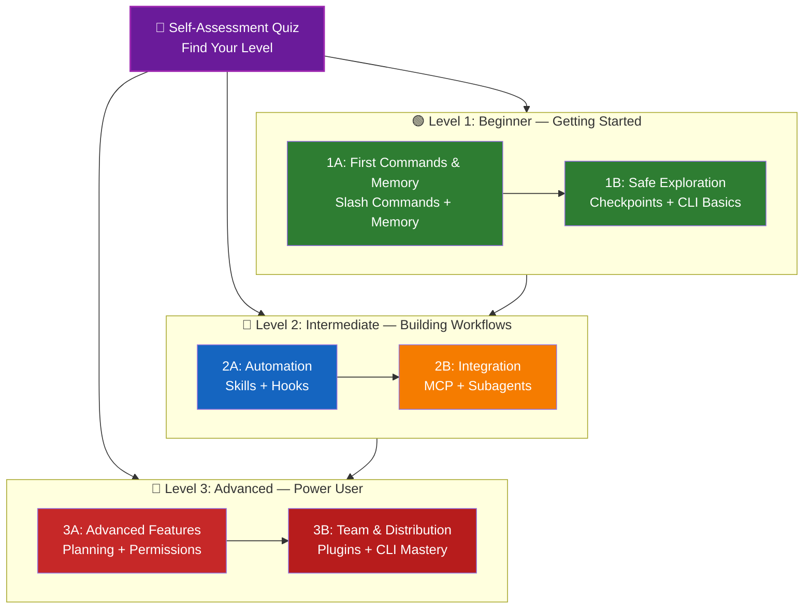

<picture>
  <source media="(prefers-color-scheme: dark)" srcset="resources/logos/claude-howto-logo-dark.svg">
  
</picture>

# 📚 Claude 代码学习路线图

**Claude Code 新手？** 本指南可帮助您按照自己的进度掌握 Claude Code 功能。无论您是初学者还是经验丰富的开发人员，都可以从下面的自我评估测验开始，找到适合您的道路。

---

## 🧭 找到你的水平

并非每个人都从同一个地方开始。通过这个快速自我评估来找到正确的切入点。

**诚实地回答这些问题：**

- [ ] 我可以启动 Claude Code 并进行对话 (`claude`)
- [ ] 我已经创建或编辑了 CLAUDE.md 文件
- [ ] 我至少使用了 3 个内置斜杠命令（例如 /help、/compact、/model）
- [ ] 我创建了自定义斜线命令或skills (SKILL.md)
- [ ] 我已经配置了 MCP 服务器（例如 GitHub、数据库）
- [ ] 我已经在 ~/.claude/settings.json 中设置了Hook
- [ ] 我已创建或使用自定义Subagents (.claude/agents/)
- [ ] 我已使用打印模式 (`claude -p`) 进行脚本编写或 CI/CD

**您的级别：**

|检查|水平|开始于 |完成时间 |
|--------|--------|----------|--------------------|
| 0-2 | **级别 1：初学者** — 入门 | [Milestone 1A](#milestone-1a-first-commands--memory) |约 3 小时 |
| 3-5 | 3-5 **级别 2：中级** — 构建工作流程 | [Milestone 2A](#milestone-2a-automation-skills--hooks) |约 5 小时 |
| 6-8 | **级别 3：高级** — 高级用户和团队负责人 | [Milestone 3A](#milestone-3a-advanced-features) |约 5 小时 |

> **提示**：如果您不确定，请从低一级开始。快速回顾熟悉的材料比错过基本概念要好。

> **交互式版本**：在 Claude Code 中运行 `/self-assessment` 进行引导式交互式测验，对您在所有 10 个功能领域的熟练程度进行评分，并生成个性化的学习路径。

---

## 🎯学习哲学

此存储库中的文件夹根据三个关键原则按照**推荐的学习顺序**进行编号：

1. **依赖关系** - 基础概念优先
2. **复杂性** - 简单的功能优先于高级的功能
3. **使用频率** - 早期教授的最常见功能

这种方法可确保您打下坚实的基础，同时获得立竿见影的生产力优势。

---

## 🗺️ 你的学习路径

**颜色图例：**
- 💜 紫色：自我评估测验
- 🟢 绿色：1 级 — 初学者路径
- 🔵 蓝色 / 🟡 金色：2 级 — 中级路径
- 🔴 红色：3 级 — 高级路径

---

## 📊 完整路线图表

|步骤|特色|复杂性 |时间 |水平|依赖关系 |为什么要学习这个 |主要优点 |
|------|---------|------------|------|--------|--------------|----------------|--------------|
| **1** | [Slash Commands](01-slash-commands/) | ⭐ 初学者 | 30 分钟 | 1 级 |无 |快速提高生产力（55 种以上内置skills + 5 种捆绑skills）|即时自动化，团队标准|
| **2** | [Memory](02-memory/) | ⭐⭐ 初学者+ | 45 分钟 | 1 级 |无 |所有功能必不可少 |持久的上下文、偏好 |
| **3** | [Checkpoints](08-checkpoints/) | ⭐⭐ 中级 | 45 分钟 | 1 级 |会话管理 |安全勘探|实验、恢复|
| **4** | [CLI Basics](10-cli/) | ⭐⭐ 初学者+ | 30 分钟 | 1 级 |无 |核心 CLI 用法 |交互和打印模式 |
| **5** | [Skills](03-skills/) | ⭐⭐ 中级 | 1小时| 2 级 |斜线命令 |自动化专业知识 |可重复使用的能力，一致性|
| **6** | [Hooks](06-hooks/) | ⭐⭐ 中级 | 1小时| 2 级 |工具、命令 |工作流程自动化（25 个事件，4 种类型）|验证、质量门 |
| **7** | [MCP](05-mcp/) | ⭐⭐⭐ 中级+ | 1小时| 2 级 |配置|实时数据访问 |实时集成、API |
| **8** | [Subagents](04-subagents/) | ⭐⭐⭐ 中级+ | 1.5 小时 | 2 级 |内存、命令 |复杂的任务处理（6 个内置，包括 Bash） |代表团、专业知识|
| **9** | [Advanced Features](09-advanced-features/) | ⭐⭐⭐⭐⭐ 进阶 | 2-3小时| 3 级 |之前所有 |高级用户工具 |规划、自动模式、频道、语音听写、权限 |
| **10** | [Plugins](07-plugins/) | ⭐⭐⭐⭐ 进阶 | 2小时| 3 级 |之前所有 |完整的解决方案|团队入职、分配 |
| **11** | [CLI Mastery](10-cli/) | ⭐⭐⭐ 进阶 | 1小时| 3 级 |推荐：全部 |掌握命令行用法 |脚本、CI/CD、自动化 |

**总学习时间**：约 11-13 小时（或跳至您的级别并节省时间）

---

## 🟢 1 级：初学者 — 入门

**针对**：进行 0-2 次测验检查的用户
**时间**：约3小时
**重点**：立即提高生产力，了解基础知识
**结果**：舒适的日常用户，为 2 级做好准备

### 里程碑 1A：第一个命令和记忆

**主题**：斜杠命令 + 内存
**时间**：1-2小时
**复杂性**：⭐ 初学者
**目标**：通过自定义命令和持久上下文立即提高生产力

#### 你将取得什么成就
✅ 为重复任务创建自定义斜线命令
✅ 为团队标准设置项目记忆
✅ 配置个人偏好
✅ 了解 Claude 如何自动加载上下文

#### 动手练习
```bash
# Exercise 1: Install your first slash command
mkdir -p .claude/commands
cp 01-slash-commands/optimize.md .claude/commands/

# Exercise 2: Create project memory
cp 02-memory/project-CLAUDE.md ./CLAUDE.md

# Exercise 3: Try it out
# In Claude Code, type: /optimize
```
#### 成功标准
- [ ] 成功调用 `/optimize` 命令
- [ ] Claude 记得来自 CLAUDE.md 的项目标准
- [ ] 你了解何时使用斜杠命令与内存

#### 后续步骤
一旦感到舒服，请阅读：
- [01-slash-commands/README.md](01-slash-commands/README.md)
- [02-memory/README.md](02-memory/README.md)

> **检查您的理解**：在 Claude Code 中运行 `/lesson-quiz slash-commands` 或 `/lesson-quiz memory` 来测试您所学到的内容。

---

### 里程碑 1B：安全探索

**主题**：检查点 + CLI 基础知识
**时间**：1小时
**复杂性**：⭐⭐ 初学者+
**目标**：学习安全地进行实验并使用核心 CLI 命令

#### 你将取得什么成就
✅ 创建和恢复检查点以进行安全实验
✅ 了解交互模式与打印模式
✅ 使用基本的 CLI 标志和选项
✅ 通过管道处理文件

#### 动手练习
```bash
# Exercise 1: Try checkpoint workflow
# In Claude Code:
# Make some experimental changes, then press Esc+Esc or use /rewind
# Select the checkpoint before your experiment
# Choose "Restore code and conversation" to go back

# Exercise 2: Interactive vs Print mode
claude "explain this project"           # Interactive mode
claude -p "explain this function"       # Print mode (non-interactive)

# Exercise 3: Process file content via piping
cat error.log | claude -p "explain this error"
```
#### 成功标准
- [ ] 创建并恢复到检查点
- [ ] 同时使用交互和打印模式
- [ ] 通过管道将文件发送给 Claude 进行分析
- [ ] 了解何时使用检查点进行安全实验

#### 后续步骤
- 阅读：[08-checkpoints/README.md](08-checkpoints/README.md)
- 阅读：[10-cli/README.md](10-cli/README.md)
- **准备好进入 2 级！** 前往 [Milestone 2A](#milestone-2a-automation-skills--hooks)

> **检查您的理解**：运行 `/lesson-quiz checkpoints` 或 `/lesson-quiz cli` 来验证您是否已准备好进入第 2 级。

---

## 🔵 2 级：中级 — 构建工作流程

**针对**：经过 3-5 次测验检查的用户
**时间**：约5小时
**重点**：自动化、集成、任务委派
**结果**：自动化工作流程、外部集成，为第 3 级做好准备

### 先决条件检查

在开始第 2 级之前，请确保您熟悉这些第 1 级概念：

- [ ] 可以创建和使用斜杠命令 ([01-slash-commands/](01-slash-commands/))
- [ ] 已通过 CLAUDE.md 设置项目内存 ([02-memory/](02-memory/))
- [ ] 了解如何创建和恢复检查点 ([08-checkpoints/](08-checkpoints/))
- [ ] 可以从命令行使用 `claude` 和 `claude -p` ([10-cli/](10-cli/))

> **差距？** 在继续之前查看上面的链接教程。

---

### 里程碑 2A：自动化（skills + hooks）

**主题**：skills+hooks
**时间**：2-3小时
**复杂性**：⭐⭐ 中级
**目标**：自动化常见工作流程和质量检查

#### 你将取得什么成就
✅ 使用 YAML frontmatter 自动调用专用功能（包括 `effort` 和 `shell` 字段）
✅ 跨 25 个hooks事件设置事件驱动的自动化
✅ 使用全部 4 种Hook类型（命令、http、提示、agents）
✅ 执行代码质量标准
✅ 为您的工作流程创建自定义hooks

#### 动手练习
```bash
# Exercise 1: Install a skill
cp -r 03-skills/code-review ~/.claude/skills/

# Exercise 2: Set up hooks
mkdir -p ~/.claude/hooks
cp 06-hooks/pre-tool-check.sh ~/.claude/hooks/
chmod +x ~/.claude/hooks/pre-tool-check.sh

# Exercise 3: Configure hooks in settings
# Add to ~/.claude/settings.json:
{
  "hooks": {
    "PreToolUse": [
      {
        "matcher": "Bash",
        "hooks": [
          {
            "type": "command",
            "command": "~/.claude/hooks/pre-tool-check.sh"
          }
        ]
      }
    ]
  }
}
```
#### 成功标准
- [ ] 相关时自动调用代码审查skills
- [ ] PreToolUse hooks在工具执行之前运行
- [ ] 您了解skills自动调用与hooks事件触发

#### 后续步骤
- 创建您自己的自定义skills
- 为您的工作流程设置额外的hooks
- 阅读：[03-skills/README.md](03-skills/README.md)
- 阅读：[06-hooks/README.md](06-hooks/README.md)

> **检查您的理解**：在继续之前运行 `/lesson-quiz skills` 或 `/lesson-quiz hooks` 来测试您的知识。

---

### 里程碑 2B：集成（MCP + Subagents）

**主题**：MCP + Subagents
**时间**：2-3小时
**复杂性**：⭐⭐⭐ 中级+
**目标**：集成外部服务并委派复杂的任务

#### 你将取得什么成就
✅ 从 GitHub、数据库等访问实时数据。
✅ 将工作委托给专门的人工智能agents
✅ 了解何时使用 MCP 与Subagents
✅ 建立集成的工作流程

#### 动手练习
```bash
# Exercise 1: Set up GitHub MCP
export GITHUB_TOKEN="your_github_token"
claude mcp add github -- npx -y @modelcontextprotocol/server-github

# Exercise 2: Test MCP integration
# In Claude Code: /mcp__github__list_prs

# Exercise 3: Install subagents
mkdir -p .claude/agents
cp 04-subagents/*.md .claude/agents/
```
#### 整合练习
尝试这个完整的工作流程：
1.使用MCP获取GitHub PR
2. 让 Claude 将审核委托给代码审核者Subagents
3.使用hooks自动运行测试

#### 成功标准
- [ ] 通过MCP成功查询GitHub数据
- [ ] claude将复杂的任务委托给Subagents
- [ ] 你了解MCP和Subagents之间的区别
- [ ] 在工作流程中组合 MCP + Subagents + hooks

#### 后续步骤
- 设置额外的 MCP 服务器（数据库、Slack 等）
- 为您的域创建自定义Subagents
- 阅读：[05-mcp/README.md](05-mcp/README.md)
- 阅读：[04-subagents/README.md](04-subagents/README.md)
- **准备好进入 3 级！** 继续 [Milestone 3A](#milestone-3a-advanced-features)

> **检查您的理解**：运行 `/lesson-quiz mcp` 或 `/lesson-quiz subagents` 来验证您是否已准备好进入第 3 级。

---

## 🔴 第 3 级：高级 — 高级用户和团队负责人

**针对**：完成 6-8 次测验的用户
**时间**：约5小时
**重点**：团队工具、CI/CD、企业功能、Plugins开发
**结果**：高级用户，可以设置团队工作流程和 CI/CD

### 先决条件检查

在开始第 3 级之前，请确保您熟悉这些第 2 级概念：

- [ ] 可以通过自动调用创建和使用skills ([03-skills/](03-skills/))
- [ ] 已设置事件驱动自动化的hooks ([06-hooks/](06-hooks/))
- [ ] 可以为外部数据配置 MCP 服务器 ([05-mcp/](05-mcp/))
- [ ] 了解如何使用Subagents进行任务委派 ([04-subagents/](04-subagents/))

> **差距？** 在继续之前查看上面的链接教程。

---

### 里程碑 3A：高级功能

**主题**：高级功能（规划、权限、扩展思维、自动模式、频道、语音听写、远程/桌面/Web）
**时间**：2-3小时
**复杂性**：⭐⭐⭐⭐⭐ 高级
**目标**：掌握高级工作流程和高级用户工具

#### 你将取得什么成就
✅ 复杂功能的规划模式
✅ 6种模式的细粒度权限控制（default、acceptEdits、plan、auto、dontAsk、bypassPermissions）
✅ 通过 Alt+T / Option+T 切换扩展思维
✅ 后台任务管理
✅ 自动记忆习得的偏好
✅ 带后台安全分类器的自动模式
✅ 结构化多会话工作流程的渠道
✅ 语音听写，实现免提交互
✅ 远程控制、桌面应用程序和网络会话
✅ agents团队用于多agents协作

#### 动手练习
```bash
# Exercise 1: Use planning mode
/plan Implement user authentication system

# Exercise 2: Try permission modes (6 available: default, acceptEdits, plan, auto, dontAsk, bypassPermissions)
claude --permission-mode plan "analyze this codebase"
claude --permission-mode acceptEdits "refactor the auth module"
claude --permission-mode auto "implement the feature"

# Exercise 3: Enable extended thinking
# Press Alt+T (Option+T on macOS) during a session to toggle

# Exercise 4: Advanced checkpoint workflow
# 1. Create checkpoint "Clean state"
# 2. Use planning mode to design a feature
# 3. Implement with subagent delegation
# 4. Run tests in background
# 5. If tests fail, rewind to checkpoint
# 6. Try alternative approach

# Exercise 5: Try auto mode (background safety classifier)
claude --permission-mode auto "implement user settings page"

# Exercise 6: Enable agent teams
export CLAUDE_AGENT_TEAMS=1
# Ask Claude: "Implement feature X using a team approach"

# Exercise 7: Scheduled tasks
/loop 5m /check-status
# Or use CronCreate for persistent scheduled tasks

# Exercise 8: Channels for multi-session workflows
# Use channels to organize work across sessions

# Exercise 9: Voice Dictation
# Use voice input for hands-free interaction with Claude Code
```
#### 成功标准
- [ ] 对复杂功能使用规划模式
- [ ] 配置权限模式（计划、acceptEdits、auto、dontAsk）
- [ ] 使用 Alt+T / Option+T 切换扩展思维
- [ ] 使用带有后台安全分类器的自动模式
- [ ] 用于长时间操作的后台任务
- [ ] 探索多会话工作流程的渠道
- [ ] 尝试使用语音听写进行免提输入
- [ ] 了解远程控制、桌面应用程序和 Web 会话
- [ ] 启用并使用agents团队来执行协作任务
- [ ] 用于重复任务或计划监控的 `/loop`

#### 后续步骤
- 阅读：[09-advanced-features/README.md](09-advanced-features/README.md)

> **检查您的理解**：运行 `/lesson-quiz advanced` 来测试您对高级用户功能的掌握程度。

---

### 里程碑 3B：团队和分发（Plugins + CLI 掌握）

**主题**：Plugins + CLI 掌握 + CI/CD
**时间**：2-3小时
**复杂性**：⭐⭐⭐⭐ 高级
**目标**：构建团队工具、创建Plugins、掌握 CI/CD 集成

#### 你将取得什么成就
✅ 安装并创建完整的捆绑Plugins
✅ 掌握用于脚本编写和自动化的 CLI
✅ 设置与 `claude -p` 的 CI/CD 集成
✅ 用于自动化管道的 JSON 输出
✅ 会话管理和批处理

#### 动手练习
```bash
# Exercise 1: Install a complete plugin
# In Claude Code: /plugin install pr-review

# Exercise 2: Print mode for CI/CD
claude -p "Run all tests and generate report"

# Exercise 3: JSON output for scripts
claude -p --output-format json "list all functions"

# Exercise 4: Session management and resumption
claude -r "feature-auth" "continue implementation"

# Exercise 5: CI/CD integration with constraints
claude -p --max-turns 3 --output-format json "review code"

# Exercise 6: Batch processing
for file in *.md; do
  claude -p --output-format json "summarize this: $(cat $file)" > ${file%.md}.summary.json
done
```
#### CI/CD 集成练习
创建一个简单的 CI/CD 脚本：
1.使用`claude -p`查看更改的文件
2. 将结果输出为JSON
3. 与 `jq` 处理具体问题
4. 集成到 GitHub Actions 工作流程中

#### 成功标准
- [ ] 安装并使用Plugins
- [ ] 为您的团队构建或修改Plugins
- [ ] 在 CI/CD 中使用打印模式 (`claude -p`)
- [ ] 为脚本生成 JSON 输出
- [ ] 成功恢复上一个会话
- [ ] 创建批处理脚本
- [ ] 将 Claude 集成到 CI/CD 工作流程中

#### CLI 的实际用例
- **代码审查自动化**：在 CI/CD 管道中运行代码审查
- **日志分析**：分析错误日志和系统输出
- **文档生成**：批量生成文档
- **测试见解**：分析测试失败
- **绩效分析**：审查绩效指标
- **数据处理**：转换和分析数据文件

#### 后续步骤
- 阅读：[07-plugins/README.md](07-plugins/README.md)
- 阅读：[10-cli/README.md](10-cli/README.md)
- 创建团队范围的 CLI 快捷方式和Plugins
- 设置批处理脚本

> **检查您的理解**：运行 `/lesson-quiz plugins` 或 `/lesson-quiz cli` 来确认您的掌握程度。

---

## 🧪 测试你的知识

该存储库包含两种交互skills，您可以随时在 Claude Code 中使用来评估您的理解情况：

|skills|命令 |目的|
|--------|---------|---------|
| **自我评估** | `/self-assessment` |评估您对所有 10 项功能的总体熟练程度。选择快速（2 分钟）或深度（5 分钟）模式以获得个性化的skills概况和学习路径。 |
| **课程测验** | `/lesson-quiz [lesson]` |用 10 个问题测试您对特定课程的理解。在课前（预测试）、课中（进度检查）或课后（掌握情况验证）使用。 |

**示例：**
```
/self-assessment                  # Find your overall level
/lesson-quiz hooks                # Quiz on Lesson 06: Hooks
/lesson-quiz 03                   # Quiz on Lesson 03: Skills
/lesson-quiz advanced-features    # Quiz on Lesson 09
```
---

## ⚡ 快速入门路径

### 如果你只有 15 分钟
**目标**：获得第一场胜利

1.复制一条斜杠命令：`cp 01-slash-commands/optimize.md .claude/commands/`
2. 在claude代码中尝试一下：`/optimize`
3. 阅读：[01-slash-commands/README.md](01-slash-commands/README.md)

**结果**：您将拥有一个有效的斜杠命令并了解基础知识

---

### 如果你有 1 小时
**目标**：建立必要的生产力工具

1. **斜线命令**（15 分钟）：复制并测试 `/optimize` 和 `/pr`
2. **项目记忆**（15 分钟）：使用您的项目标准创建 CLAUDE.md
3. **安装skills**（15 分钟）：设置代码审查skills
4. **一起尝试它们**（15 分钟）：看看它们如何协调工作

**结果**：通过命令、内存和自动skills提高基本生产力

---

### 如果你有周末
**目标**：精通大多数功能

**周六上午**（3小时）：
- 完成里程碑 1A：斜线命令 + 内存
- 完成里程碑 1B：检查点 + CLI 基础知识

**周六下午**（3小时）：
- 完成里程碑 2A：skills + hooks
- 完成里程碑 2B：MCP + Subagents

**周日**（4 小时）：
- 完成里程碑 3A：高级功能
- 完成里程碑 3B：Plugins + CLI 掌握 + CI/CD
- 为您的团队构建自定义Plugins

**结果**：您将成为 Claude Code 高级用户，准备好培训其他人并自动化复杂的工作流程

---

## 💡学习技巧

### ✅ 做

- **先参加测验**找到你的起点
- **每个里程碑完成实践练习**
- **从简单开始**并逐渐增加复杂性
- **测试每个功能**，然后再进行下一个功能
- **记下**什么适合您的工作流程
- **在学习高级主题时回顾**早期概念
- **使用检查点安全地进行实验**
- **与您的团队分享知识**

### ❌不要

- **跳转到更高级别时跳过先决条件检查**
- **尝试一次学习所有内容** - 这是压倒性的
- **在不理解配置的情况下复制配置** - 你将不知道如何调试
- **忘记测试** - 始终验证功能是否有效
- **冲过里程碑** - 花时间去理解
- **忽略文档** - 每个自述文件都有有价值的细节
- **独立工作** - 与队友讨论

---

## 🎓 学习风格

### 视觉学习者
- 研究每个自述文件中的Mermaid图
- 观察命令执行流程
- 绘制自己的流程图
- 使用上面的视觉学习路径

### 实践学习者
- 完成每一个实践练习
- 尝试各种变化
- 破坏并修复它们（使用检查点！）
- 创建您自己的示例

### 阅读学习者
- 仔细阅读每个自述文件
- 研究代码示例
- 查看比较表
- 阅读资源中链接的博客文章

### 社交学习者
- 设置结对编程课程
- 向队友传授概念
- 加入 Claude Code 社区讨论
- 分享您的自定义配置

---

## 📈 进度跟踪

使用这些清单来按级别跟踪您的进度。随时运行 `/self-assessment` 来获取更新的skills概况，或者在每个教程之后运行 `/lesson-quiz [lesson]` 来验证您的理解。

### 🟢 1 级：初学者
- [ ] 已完成 [01-slash-commands](01-slash-commands/)
- [ ] 已完成 [02-memory](02-memory/)
- [ ] 创建第一个自定义斜线命令
- [ ] 设置项目内存
- [ ] **实现里程碑 1A**
- [ ] 已完成 [08-checkpoints](08-checkpoints/)
- [ ] 已完成 [10-cli](10-cli/) 基础知识
- [ ] 创建并恢复到检查点
- [ ] 使用交互和打印模式
- [ ] **实现里程碑 1B**

### 🔵 2 级：中级
- [ ] 已完成 [03-skills](03-skills/)
- [ ] 已完成 [06-hooks](06-hooks/)
- [ ]安装第一个skills
- [ ] 设置 PreToolUse Hook
- [ ] **实现里程碑 2A**
- [ ] 已完成 [05-mcp](05-mcp/)
- [ ] 已完成 [04-subagents](04-subagents/)
- [ ] 连接 GitHub MCP
- [ ] 创建自定义Subagents
- [ ] 工作流程中的组合集成
- [ ] **实现里程碑 2B**

### 🔴第 3 级：高级
- [ ] 已完成 [09-advanced-features](09-advanced-features/)
- [ ] 成功使用计划模式
- [ ] 配置权限模式（包括自动在内的6种模式）
- [ ] 使用带有安全分类器的自动模式
- [ ] 使用扩展思维切换
- [ ] 探索频道和语音听写
- [ ] **实现里程碑 3A**
- [ ] 已完成 [07-plugins](07-plugins/)
- [ ] 已完成 [10-cli](10-cli/) 高级用法
- [ ] 设置打印模式 (`claude -p`) CI/CD
- [ ] 创建 JSON 输出以实现自动化
- [ ] 将 Claude 集成到 CI/CD 管道中
- [ ] 创建团队Plugins
- [ ] **实现里程碑 3B**

---

## 🆘 常见的学习挑战

### 挑战 1：“同时出现太多概念”
**解决方案**：一次专注于一个里程碑。在继续之前完成所有练习。

### 挑战 2：“不知道何时使用哪个功能”
**解决方案**：请参阅主自述文件中的 [Use Case Matrix](README.md#use-case-matrix)。

### 挑战 3：“配置不起作用”
**解决方案**：检查 [Troubleshooting](README.md#troubleshooting) 部分并验证文件位置。

### 挑战 4：“概念似乎重叠”
**解决方案**：查看 [Feature Comparison](README.md#feature-comparison) 表以了解差异。

### 挑战 5：“很难记住所有事情”
**解决方案**：创建您自己的备忘单。使用检查点安全地进行实验。

### 挑战 6：“我有经验，但不知道从哪里开始”
**解决方案**：采用上面的[Self-Assessment Quiz](#-find-your-level)。跳到您的级别并使用先决条件检查来识别任何差距。

---

## 🎯 完成后下一步做什么？

完成所有里程碑后：

1. **创建团队文档** - 记录您团队的 Claude Code 设置
2. **构建自定义Plugins** - 打包团队的工作流程
3. **探索远程控制** - 从外部工具以编程方式控制 Claude Code 会话
4. **尝试 Web Sessions** - 通过基于浏览器的界面使用 Claude Code 进行远程开发
5. **使用桌面应用程序** - 通过本机桌面应用程序访问 Claude Code 功能
6. **使用自动模式** - 让 Claude 使用后台安全分类器自主工作
7. **利用自动记忆** - 让claude随着时间的推移自动了解您的偏好
8. **设置agents团队** - 协调多个agents执行复杂、多方面的任务
9. **使用渠道** - 跨结构化多会话工作流程组织工作
10. **尝试语音听写** - 使用免提语音输入与 Claude Code 交互
11. **使用计划任务** - 使用 `/loop` 和 cron 工具自动执行定期检查
12. **贡献示例** - 与社区分享
13. **指导他人** - 帮助队友学习
14. **优化工作流程** - 根据使用情况持续改进
15. **保持更新** - 关注 Claude Code 版本和新功能

---

## 📚 其他资源

### 官方文档
- [Claude Code Documentation](https://code.claude.com/docs/en/overview)
- [Anthropic Documentation](https://docs.anthropic.com)
- [MCP Protocol Specification](https://modelcontextprotocol.io)

### 博客文章
- [Discovering Claude Code Slash Commands](https://medium.com/@luongnv89/discovering-claude-code-slash-commands-cdc17f0dfb29)

### 社区
- [Anthropic Cookbook](https://github.com/anthropics/anthropic-cookbook)
- [MCP Servers Repository](https://github.com/modelcontextprotocol/servers)

---

## 💬 反馈与支持

- **发现问题？** 在存储库中创建问题
- **有建议吗？** 提交拉取请求
- **需要帮助？** 查看文档或询问社区

---

**最后更新**：2026 年 3 月
**维护者**：Claude How-To 贡献者
**许可证**：教育目的，免费使用和改编

---

[← Back to Main README](README.md)
