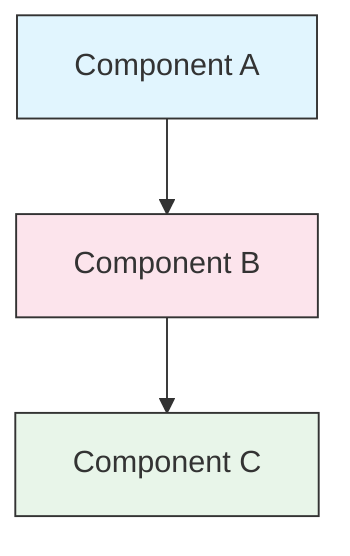

<picture>
  <source media="(prefers-color-scheme: dark)" srcset="resources/logos/claude-howto-logo-dark.svg">
  
</picture>

# 风格指南

> 为 Claude How To 做出贡献的约定和格式规则。遵循本指南可保持内容一致、专业且易于维护。

---

## 目录

- [File and Folder Naming](#file-and-folder-naming)
- [Document Structure](#document-structure)
- [Headings](#headings)
- [Text Formatting](#text-formatting)
- [Lists](#lists)
- [Tables](#tables)
- [Code Blocks](#code-blocks)
- [Links and Cross-References](#links-and-cross-references)
- [Diagrams](#diagrams)
- [Emoji Usage](#emoji-usage)
- [YAML Frontmatter](#yaml-frontmatter)
- [Images and Media](#images-and-media)
- [Tone and Voice](#tone-and-voice)
- [Commit Messages](#commit-messages)
- [Checklist for Authors](#checklist-for-authors)

---

## 文件和文件夹命名

### 课程文件夹

课程文件夹使用**两位数编号前缀**，后跟 **kebab-case** 描述符：
```
01-slash-commands/
02-memory/
03-skills/
04-subagents/
05-mcp/
```
该数字反映了从初级到高级的学习路径顺序。

### 文件名

|类型 |大会 |示例 |
|------|------------|----------|
| **课程自述文件** | `README.md` | `01-slash-commands/README.md` |
| **功能文件** |烤肉串盒 `.md` | `code-reviewer.md`、`generate-api-docs.md` |
| **Shell 脚本** |烤肉串盒 `.sh` | `format-code.sh`、`validate-input.sh` |
| **配置文件** |标准名称| `.mcp.json`、`settings.json` |
| **内存文件** |范围前缀 | `project-CLAUDE.md`、`personal-CLAUDE.md` |
| **顶级文档** |大写 `.md` | `CATALOG.md`、`QUICK_REFERENCE.md`、`CONTRIBUTING.md` |
| **图像资产** |烤肉串盒 | `pr-slash-command.png`、`claude-howto-logo.svg` |

### 规则

- 所有文件和文件夹名称均使用 **小写**（顶级文档除外，如 `README.md`、`CATALOG.md`）
- 使用**连字符** (`-`) 作为单词分隔符，切勿使用下划线或空格
- 保持名称具有描述性但简洁

---

## 文档结构

### 根自述文件

根 `README.md` 遵循以下顺序：

1. 徽标（`<picture>` 元素，具有深色/浅色变体）
2.H1标题
3. 介绍性块引用（一行价值主张）
4.“为什么要写本指南？”附有比较表的部分
5. 水平标尺 (`---`)
6. 目录
7. 功能目录
8. 快速导航
9. 学习路径
10. 特色部分
11. 开始使用
12. 最佳实践/故障排除
13. 贡献/许可

### 课程自述文件

每课 `README.md` 遵循以下顺序：

1. H1 标题（例如 `# Slash Commands`）
2. 简要概述段落
3. 快速参考表（可选）
4.架构图（Mermaid）
5. 详细部分（H2）
6. 实际例子（编号，4-6个例子）
7. 最佳实践（注意事项表）
8. 故障排除
9. 相关指南/官方文档
10. 文档元数据页脚

### 功能/示例文件

各个功能文件（例如 `optimize.md`、`pr.md`）：

1. YAML frontmatter（如果适用）
2.H1标题
3. 目的/描述
4. 使用说明
5. 代码示例
6. 定制技巧

### 部分分隔符

使用水平线 (`---`) 分隔主要文档区域：
```markdown
---

## New Major Section
```
将它们放置在介绍性块引用之后以及文档中逻辑上不同的部分之间。

---

## 标题

### 层次结构

|水平|使用 |示例|
|--------|-----|---------|
| `#` H1 |页面标题（每个文档一个）| `# Slash Commands` |
| `##` H2 |主要栏目| `## Best Practices` |
| `###` H3 |小节| `### Adding a Skill` |
| `####` H4 |子小节（罕见）| `#### Configuration Options` |

### 规则

- **每个文档一个 H1** — 仅页面标题
- **永远不要跳过关卡** — 不要从 H2 跳到 H4
- **保持标题简洁** — 目标是 2-5 个单词
- **使用句子大小写** - 仅将第一个单词和专有名词大写（例外：功能名称保持原样）
- **仅在根自述文件**部分标题上添加表情符号前缀（请参阅[Emoji Usage](#emoji-usage)）

---

## 文本格式

### 强调

|风格|何时使用 |示例|
|--------|------------|---------|
| **粗体** (`**text**`) |关键术语、表格中的标签、重要概念 | `**Installation**:` |
| *斜体* (`*text*`) |首次使用技术术语、书籍/文档标题 | `*frontmatter*` |
| `Code` (`` `text` ``) |文件名、命令、配置值、代码参考 | `` `CLAUDE.md` `` |

### 标注的块引号

使用带有粗体前缀的块引号来表示重要注释：
```markdown
> **Note**: Custom slash commands have been merged into skills since v2.0.

> **Important**: Never commit API keys or credentials.

> **Tip**: Combine memory with skills for maximum effectiveness.
```
支持的标注类型：**注意**、**重要**、**提示**、**警告**。

### 段落

- 保持段落简短（2-4 句话）
- 在段落之间添加空行
- 以要点引导，然后提供背景信息
- 解释“为什么”而不仅仅是“什么”

---

## 列表

### 无序列表

使用破折号 (`-`) 和 2 个空格缩进进行嵌套：
```markdown
- First item
- Second item
  - Nested item
  - Another nested item
    - Deep nested (avoid going deeper than 3 levels)
- Third item
```
### 有序列表

使用编号列表来表示顺序步骤、说明和排名项目：
```markdown
1. First step
2. Second step
   - Sub-point detail
   - Another sub-point
3. Third step
```
### 描述性列表

对键值样式列表使用粗体标签：
```markdown
- **Performance bottlenecks** - identify O(n^2) operations, inefficient loops
- **Memory leaks** - find unreleased resources, circular references
- **Algorithm improvements** - suggest better algorithms or data structures
```
### 规则

- 保持一致的缩进（每级 2 个空格）
- 在列表前后添加空行
- 保持列表项在结构上平行（全部以动词开头，或者全部都是名词等）
- 避免嵌套深度超过 3 层

---

## 表格

### 标准格式
```markdown
| Column 1 | Column 2 | Column 3 |
|----------|----------|----------|
| Data     | Data     | Data     |
```
### 常用表模式

**功能比较（3-4列）：**
```markdown
| Feature | Invocation | Persistence | Best For |
|---------|-----------|------------|----------|
| **Slash Commands** | Manual (`/cmd`) | Session only | Quick shortcuts |
| **Memory** | Auto-loaded | Cross-session | Long-term learning |
```
**注意事项：**
```markdown
| Do | Don't |
|----|-------|
| Use descriptive names | Use vague names |
| Keep files focused | Overload a single file |
```
**快速参考：**
```markdown
| Aspect | Details |
|--------|---------|
| **Purpose** | Generate API documentation |
| **Scope** | Project-level |
| **Complexity** | Intermediate |
```
### 规则

- **粗体表格标题**当它们是行标签时（第一列）
- 对齐管道以提高源代码的可读性（可选但首选）
- 保持单元格内容简洁；使用链接了解详细信息
- 使用 `code formatting` 作为单元格内的命令和文件路径

---

## 代码块

### 语言标签

始终指定语法突出显示的语言标记：

|语言 |标签 |用于 |
|----------|-----|---------|
|壳牌| `bash` | CLI 命令、脚本 |
|蟒蛇 | `python` | Python 代码 |
| JavaScript | `javascript` | JS代码|
|打字稿 | `typescript` | TS代码|
| JSON | `json` |配置文件|
| yaml | `yaml` | Frontmatter，配置 |
|降价| `markdown` | Markdown 示例 |
| SQL | `sql` |数据库查询|
|纯文本 | （无标签）|预期输出，目录树 |

### 约定
```bash
# Comment explaining what the command does
claude mcp add notion --transport http https://mcp.notion.com/mcp
```
- 在不明显的命令之前添加**注释行**
- 准备好所有示例**复制粘贴**
- 在相关时显示**简单和高级**版本
- 当有助于理解时，包括**预期输出**（使用未标记的代码块）

### 安装块

使用此模式作为安装说明：
```bash
# Copy files to your project
cp 01-slash-commands/*.md .claude/commands/
```
### 多步骤工作流程
```bash
# Step 1: Create the directory
mkdir -p .claude/commands

# Step 2: Copy the templates
cp 01-slash-commands/*.md .claude/commands/

# Step 3: Verify installation
ls .claude/commands/
```
---

## 链接和交叉引用

### 内部链接（相对）

对所有内部链接使用相对路径：
```markdown
[Slash Commands](01-slash-commands/)
[Skills Guide](03-skills/)
[Memory Architecture](02-memory/#memory-architecture)
```
从课程文件夹返回根文件夹或同级文件夹：
```markdown
[Back to main guide](../README.md)
[Related: Skills](../03-skills/)
```
### 外部链接（绝对）

使用带有描述性锚文本的完整 URL：
```markdown
[Anthropic's official documentation](https://code.claude.com/docs/en/overview)
```
- 切勿使用“单击此处”或“此链接”作为锚文本
- 使用断章取义的描述性文字

### 剖面锚

使用 GitHub 样式的锚点链接到同一文档中的部分：
```markdown
[Feature Catalog](#-feature-catalog)
[Best Practices](#best-practices)
```
### 相关指南模式

以相关指南部分结束课程：
```markdown
## Related Guides

- [Slash Commands](../01-slash-commands/) - Quick shortcuts
- [Memory](../02-memory/) - Persistent context
- [Skills](../03-skills/) - Reusable capabilities
```
---

## 图表

### Mermaid

所有图表均使用 Mermaid。支持的类型：

- `graph TB` / `graph LR` — 架构、层次结构、流程
- `sequenceDiagram` — 交互流程
- `timeline` — 按时间顺序排列

### 风格约定

使用样式块应用一致的颜色：

**调色板：**

|颜色 |十六进制 |用于 |
|--------|-----|---------|
|浅蓝色 | `#e1f5fe` |主要部件、输入|
|浅粉色| `#fce4ec` |处理、中间件|
|浅绿色| `#e8f5e9` |输出、结果 |
|浅黄色| `#fff9c4` |配置，可选 |
|浅紫色| `#f3e5f5` |面向用户的 UI |

### 规则

- 使用 `["Label text"]` 作为节点标签（启用特殊字符）
- 使用 `<br/>` 作为标签内的换行符
- 保持图表简单（最多 10-12 个节点）
- 在图表下方添加简短的文字描述以方便访问
- 对于层次结构使用从上到下 (`TB`)，对于工作流程使用从左到右 (`LR`)

---

## 表情符号的使用

### 表情符号的使用场景

表情符号的使用**谨慎而有目的地**——仅在特定的上下文中使用：

|背景 |表情符号 |示例|
|--------|--------|---------|
|根自述文件部分标题 |类别图标| `## 📚 Learning Path` |
|skills水平指标|彩色圆圈| 🟢 初级、🔵 中级、🔴 高级 |
|该做什么和不该做什么 |复选标记/十字标记 | ✅ 这样做，❌ 不要这样做 |
|复杂度评级 |明星| ⭐⭐⭐ |

### 标准表情符号集

|表情符号 |意义|
|--------|---------|
| 📚 |学习、指南、文档 |
| ⚡ |入门，快速参考 |
| 🎯 |功能，快速参考 |
| 🎓 |学习路径|
| 📊 |统计、比较 |
| 🚀 |安装、快速命令 |
| 🟢 |初级水平|
| 🔵 |中级|
| 🔴 |高级 |
| ✅ |推荐做法 |
| ❌ |避免/反模式 |
| ⭐ |复杂度评级单位 |

### 规则

- **切勿在正文或段落中使用表情符号
- **仅在根自述文件的标题中使用表情符号**（不在课程自述文件中）
- **不要添加装饰性表情符号** - 每个表情符号都应传达含义
- 保持表情符号的使用与上表一致

---

## YAML 前沿问题

### 功能文件（skills、命令、agents）
```yaml
---
name: unique-identifier
description: What this feature does and when to use it
allowed-tools: Bash, Read, Grep
---
```
### 可选字段
```yaml
---
name: my-feature
description: Brief description
argument-hint: "[file-path] [options]"
allowed-tools: Bash, Read, Grep, Write, Edit
model: opus                        # opus, sonnet, or haiku
disable-model-invocation: true     # User-only invocation
user-invocable: false              # Hidden from user menu
context: fork                      # Run in isolated subagent
agent: Explore                     # Agent type for context: fork
---
```
### 规则

- 将 frontmatter 放在文件的最顶部
- 对 `name` 字段使用 **kebab-case**
- 将 `description` 保留为一句话
- 仅包含需要的字段

---

## 图像和媒体

### 标志图案

所有以徽标开头的文档都使用 `<picture>` 元素来支持暗/亮模式：
```html
<picture>
  <source media="(prefers-color-scheme: dark)" srcset="resources/logos/claude-howto-logo-dark.svg">
  
</picture>
```
### 截图

- 存储在相关课程文件夹中（例如 `01-slash-commands/pr-slash-command.png`）
- 使用短横线大小写的文件名
- 包括描述性替代文本
- 图表首选 SVG，屏幕截图首选 PNG

### 规则

- 始终提供图像的替代文本
- 保持图像文件大小合理（PNG < 500KB）
- 使用相对路径进行图像引用
- 将图像存储在与引用它们的文档相同的目录中，或者将共享图像存储在 `assets/` 中

---

## 语气和声音

### 写作风格

- **专业但平易近人** — 技术准确，没有过多的术语
- **主动语态** — “创建文件”而不是“应创建文件”
- **直接说明** — “运行此命令”而不是“您可能想要运行此命令”
- **初学者友好** - 假设读者是 Claude Code 新手，而不是编程新手

### 内容原则

|原理|示例|
|------------|---------|
| **展示，而不是讲述** |提供工作示例，而不是抽象描述 |
| **渐进的复杂性** |从简单开始，在后面的部分中增加深度 |
| **解释“为什么”** | “将内存用于...因为...”而不仅仅是“将内存用于...” |
| **复制粘贴就绪** |每个代码块在直接粘贴时都应该可以工作 |
| **真实世界环境** |使用实际场景，而不是人为的例子 |

＃＃＃ 词汇

- 使用“Claude Code”（不是“Claude CLI”或“工具”）
- 使用“skills”（而不是“自定义命令”——旧术语）
- 对编号部分使用“课程”或“指南”
- 对各个功能文件使用“示例”

---

## 提交消息

遵循 [Conventional Commits](https://www.conventionalcommits.org/)：
```
type(scope): description
```
### 类型

|类型 |用于 |
|------|---------|
| `feat` |新功能、示例或指南 |
| `fix` |错误修复、更正、断开的链接 |
| `docs` |文档改进 |
| `refactor` |在不改变行为的情况下进行重组|
| `style` |仅格式更改 |
| `test` |测试添加或更改 |
| `chore` |构建、依赖项、CI |

### 范围

使用课程名称或文件区域作为范围：
```
feat(slash-commands): Add API documentation generator
docs(memory): Improve personal preferences example
fix(README): Correct table of contents link
docs(skills): Add comprehensive code review skill
```
---

## 文档元数据页脚

课程自述文件以元数据块结束：
```markdown
---
**Last Updated**: March 2026
**Claude Code Version**: 2.1+
**Compatible Models**: Claude Sonnet 4.6, Claude Opus 4.6, Claude Haiku 4.5
```
- 使用月 + 年格式（例如“2026 年 3 月”）
- 功能更改时更新版本
- 列出所有兼容型号

---

## 作者清单

在提交内容之前，请验证：

- [ ] 文件/文件夹名称使用短横线大小写
- [ ] 文档以 H1 标题开头（每个文件一个）
- [ ] 标题层次结构正确（没有跳过的级别）
- [ ] 所有代码块都有语言标签
- [ ] 代码示例已准备好复制粘贴
- [ ] 内部链接使用相对路径
- [ ] 外部链接有描述性锚文本
- [ ] 表格格式正确
- [ ] 表情符号遵循标准集（如果使用的话）
- [ ] Mermaid图使用标准调色板
- [ ] 没有敏感信息（API 密钥、凭证）
- [ ] YAML frontmatter 有效（如果适用）
- [ ] 图像有替代文本
- [ ] 段落简短且重点突出
- [ ] 相关指南部分链接到相关课程
- [ ] 提交消息遵循常规提交格式
