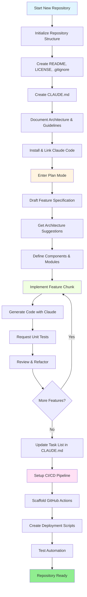
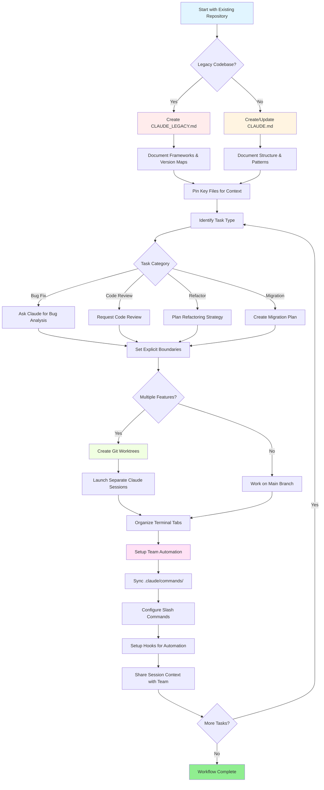

<picture>
  <source media="(prefers-color-scheme: dark)" srcset="resources/logos/claude-howto-logo-dark.svg">
  
</picture>

# 好资源列表

## 官方文档

|资源 |描述 |链接 |
|----------|-------------|------|
|claude代码文档 |claude代码官方文档 | [code.claude.com/docs/en/overview](https://code.claude.com/docs/en/overview) |
|人类文档 |完整的 Anthropic 文档 | [docs.anthropic.com](https://docs.anthropic.com) |
| MCP协议|模型上下文协议规范| [modelcontextprotocol.io](https://modelcontextprotocol.io) |
| MCP 服务器 |官方 MCP 服务器实现 | [github.com/modelcontextprotocol/servers](https://github.com/modelcontextprotocol/servers) |
|人类食谱|代码示例和教程 | [github.com/anthropics/anthropic-cookbook](https://github.com/anthropics/anthropic-cookbook) |
|claude代码skills |社区skills库 | [github.com/anthropics/skills](https://github.com/anthropics/skills) |
|agents团队|多智能体协调与协作 | [code.claude.com/docs/en/agent-teams](https://code.claude.com/docs/en/agent-teams) |
|计划任务 |使用 /loop 和 cron 执行重复任务 | [code.claude.com/docs/en/scheduled-tasks](https://code.claude.com/docs/en/scheduled-tasks) |
| Chrome 集成 |浏览器自动化 | [code.claude.com/docs/en/chrome](https://code.claude.com/docs/en/chrome) |
|按键绑定 |键盘快捷键定制 | [code.claude.com/docs/en/keybindings](https://code.claude.com/docs/en/keybindings) |
|桌面应用程序 |本机桌面应用程序 | [code.claude.com/docs/en/desktop](https://code.claude.com/docs/en/desktop) |
|远程控制|远程会话控制| [code.claude.com/docs/en/remote-control](https://code.claude.com/docs/en/remote-control) |
|自动模式|自动权限管理 | [code.claude.com/docs/en/auto-mode](https://code.claude.com/docs/en/auto-mode) |
|频道 |多渠道沟通 | [code.claude.com/docs/en/channels](https://code.claude.com/docs/en/channels) |
|语音听写 | Claude Code 的语音输入 | [code.claude.com/docs/en/voice-dictation](https://code.claude.com/docs/en/voice-dictation) |

## 人类工程博客

|文章|描述 |链接 |
|---------|-------------|------|
|使用 MCP 执行代码 |如何使用代码执行解决 MCP 上下文膨胀 — Token减少 98.7% | [anthropic.com/engineering/code-execution-with-mcp](https://www.anthropic.com/engineering/code-execution-with-mcp) |

---

## 30 分钟掌握 Claude 代码

_视频_：https://www.youtube.com/watch?v=6eBSHbLKuN0

_**所有提示**_
- **探索高级功能和快捷方式**
  - 定期检查 Claude 的发行说明中的新代码编辑和上下文功能。
  - 学习键盘快捷键以在聊天、文件和编辑器视图之间快速切换。

- **高效设置**
  - 创建具有清晰名称/描述的特定于项目的会话，以便于检索。
  - 固定最常用的文件或文件夹，以便claude可以随时访问它们。
  - 设置 Claude 的集成（例如 GitHub、流行的 IDE）以简化您的编码流程。

- **有效的代码库问答**
  - 向 Claude 询问有关架构、设计模式和特定模块的详细问题。
  - 在问题中使用文件和行引用（例如，“`app/models/user.py` 中的逻辑实现了什么？”）。
  - 对于大型代码库，提供摘要或清单以帮助 Claude 集中注意力。
  - **示例提示**：_“您能解释一下 src/auth/AuthService.ts:45-120 中实现的身份验证流程吗？它是如何与 src/middleware/auth.ts 中的中间件集成的？”_

- **代码编辑和重构**
  - 在代码块中使用内联注释或请求来进行集中编辑（“为了清晰起见重构此函数”）。
  - 要求进行前后比较。
  - 让 Claude 在进行重大编辑后生成测试或文档以保证质量。
  - **示例提示**：_“重构 api/users.js 中的 getUserData 函数以使用 async/await 而不是 Promise。显示前后比较并为重构版本生成单元测试。”_

- **上下文管理**
  - 将粘贴的代码/上下文限制为仅与当前任务相关的内容。
  - 使用结构化提示（“这是文件 A，这是函数 B，我的问题是 X”）以获得最佳性能。
  - 在提示窗口中删除或折叠大文件，以避免超出上下文限制。
  - **示例提示**：_“这是来自 models/User.js 的用户模型和来自 utils/validation.js 的 validateUser 函数。我的问题是：如何在保持向后兼容性的同时添加电子邮件验证？”_

- **集成团队工具**
  - 将 Claude 会话连接到您团队的存储库和文档。
  - 使用内置模板或创建自定义模板来执行重复的工程任务。
  - 通过与队友共享会话记录和提示进行协作。

- **提升性能**
  - 给claude明确的、以目标为导向的指示（例如，“用五个要点总结这门课”）。
  - 从上下文窗口中删除不必要的注释和样板文件。
  - 如果claude的输出偏离了轨道，请重置上下文或重新措辞问题以更好地对齐。
  - **示例提示**：_“用五个要点总结 src/db/Manager.ts 中的 DatabaseManager 类，重点介绍其主要职责和关键方法。”_

- **实际使用示例**
  - 调试：粘贴错误和堆栈跟踪，然后询问可能的原因和修复。
  - 测试生成：请求针对复杂逻辑的基于属性的单元测试或集成测试。
  - 代码审查：要求 Claude 识别有风险的更改、边缘情况或代码异味。
  - **提示示例**：
    - _“我收到此错误：‘TypeError: 无法读取在 elements/UserList.jsx 中第 42 行未定义的属性‘map’。这是堆栈跟踪和相关代码。导致此问题的原因是什么以及如何修复它？”_
    - _“为 PaymentProcessor 类生成全面的单元测试，包括失败交易、超时和无效输入的边缘情况。”_
    - _“查看此拉取请求差异并识别潜在的安全问题、性能瓶颈和代码异味。”_

- **工作流程自动化**
  - 使用 Claude 提示编写重复性任务的脚本（例如格式化、清理和重复重命名）。
  - 使用 Claude 根据代码差异起草 PR 描述、发行说明或文档。
  - **示例提示**：_“基于 git diff，创建详细的 PR 描述，其中包含更改摘要、修改文件列表、测试步骤和潜在影响。同时生成版本 2.3.0 的发行说明。”_

**提示**：为了获得最佳结果，请结合其中的几种实践 - 首先固定关键文件并总结您的目标，然后使用重点提示和 Claude 的重构工具来逐步改进您的代码库和自动化。

**使用 Claude Code 的推荐工作流程**

### 使用claude代码的推荐工作流程

#### 对于新存储库

1. **初始化 Repo 和 Claude 集成**
   - 使用基本结构设置新存储库：自述文件、许可证、.gitignore、根配置。
   - 创建一个 `CLAUDE.md` 文件来描述架构、高级目标和编码指南。
   - 安装 Claude Code 并将其链接到您的存储库以获取代码建议、测试脚手架和工作流程自动化。

2. **使用计划模式和规格**
   - 在实现功能之前使用计划模式（`shift-tab` 或 `/plan`）起草详细规范。
   - 向 Claude 询问架构建议和初始项目布局。
   - 保持清晰、以目标为导向的提示顺序——询问组件大纲、主要模块和职责。

3. **迭代开发和审查**
   - 以小块的方式实现核心功能，提示 Claude 进行代码生成、重构和文档编制。
   - 每次增量后请求单元测试和示例。
   - 在 CLAUDE.md 中维护正在运行的任务列表。

4. **自动化 CI/CD 和部署**
   - 使用 Claude 构建 GitHub Actions、npm/yarn 脚本或部署工作流程。
   - 通过更新 CLAUDE.md 并请求相应的命令/脚本来轻松调整管道。

#### 对于现有存储库

1. **存储库和上下文设置**
   - 添加或更新 `CLAUDE.md` 以记录存储库结构、编码模式和关键文件。对于旧版存储库，请使用 `CLAUDE_LEGACY.md` 涵盖框架、版本映射、说明、错误和升级说明。
   - 固定或突出显示claude应用于上下文的主要文件。

2. **上下文代码问答**
   - 向 Claude 询问代码审查、错误解释、重构或引用特定文件/函数的迁移计划。
   - 给claude明确的界限（例如，“仅修改这些文件”或“没有新的依赖项”）。

3. **分支、工作树和多会话管理**
   - 使用多个 git 工作树来实现独立的功能或错误修复，并为每个工作树启动单独的 Claude 会话。
   - 按分支或功能组织终端选项卡/窗口以实现并行工作流程。

4. **团队工具和自动化**
   - 通过 `.claude/commands/` 同步自定义命令以实现跨团队一致性。
   - 通过 Claude 的斜杠命令或hooks自动执行重复任务、PR 创建和代码格式化。
   - 与团队成员共享会话和上下文，以进行协作故障排除和审查。

**提示**：
- 使用规格和计划模式提示启动每个新功能或修复。
- 对于遗留和复杂的存储库，请将详细指南存储在 CLAUDE.md/CLAUDE_LEGACY.md 中。
- 给出清晰、有针对性的指示，并将复杂的工作分解为多阶段计划。
- 定期清理会话、修剪上下文并删除已完成的工作树以避免混乱。

这些步骤捕获了在新代码库和现有代码库中使用 Claude Code 实现平稳工作流程的核心建议。

---

## 新特性和功能（2026 年 3 月）

### 关键功能资源

|特色|描述 |了解更多 |
|--------|-------------|------------|
| **自动记忆** |claude在会话中自动学习并记住您的偏好 | [Memory Guide](02-memory/) |
| **远程控制** |通过外部工具和脚本以编程方式控制 Claude Code 会话 | [Advanced Features](09-advanced-features/) |
| **网络会议** |通过基于浏览器的界面访问 Claude Code 进行远程开发 | [CLI Reference](10-cli/) |
| **桌面应用程序** |具有增强 UI 的 Claude Code 原生桌面应用程序 | [Claude Code Docs](https://code.claude.com/docs/en/desktop) |
| **延伸思考** |通过 `Alt+T`/`Option+T` 或 `MAX_THINKING_TOKENS` env var | 进行深度推理切换[Advanced Features](09-advanced-features/) |
| **权限模式** |细粒度控制：default、acceptEdits、plan、auto、dontAsk、bypassPermissions | [Advanced Features](09-advanced-features/) |
| **7 层内存** |托管策略、项目、项目规则、用户、用户规则、本地、自动内存 | [Memory Guide](02-memory/) |
| **hooks事件** | 25 个事件：PreToolUse、PostToolUse、PostToolUseFailure、Stop、StopFailure、SubagentStart、SubagentStop、Notification、Eliitation 等 | [Hooks Guide](06-hooks/) |
| **agents团队** |协调多个agents共同完成复杂的任务 | [Subagents Guide](04-subagents/) |
| **计划任务** |使用 `/loop` 和 cron 工具设置重复任务 | [Advanced Features](09-advanced-features/) |
| **Chrome 集成** |使用无头 Chromium 实现浏览器自动化 | [Advanced Features](09-advanced-features/) |
| **键盘定制** |自定义键绑定，包括和弦序列 | [Advanced Features](09-advanced-features/) |
